<!-- GENERATED:MODEL -->
---
tags: [odoo, community, generated, model]
---

# product.template

- Module: [[docs/Community Addons/sale/sale|sale]]
- Scope: Community Addons
- Defined in module: extension only
- Source files: `models/product_template.py`
- Python classes: `ProductTemplate`

## Field footprint

- Detected fields: 7
- Field types: `Boolean` x 1, `Float` x 1, `Many2many` x 1, `Selection` x 3, `Text` x 1
- Relation fields: 1

## Sample fields

- `expense_policy`: `Selection` (compute `_compute_expense_policy`, store `True`)
- `invoice_policy`: `Selection` (compute `_compute_invoice_policy`, store `True`)
- `optional_product_ids`: `Many2many` (comodel `product.template`)
- `sale_line_warn_msg`: `Text`
- `sales_count`: `Float` (compute `_compute_sales_count`)
- `service_type`: `Selection` (compute `_compute_service_type`, store `True`)
- `visible_expense_policy`: `Boolean` (compute `_compute_visible_expense_policy`)

## Method hints

- Detected methods: 22
- Action methods: `action_view_sales`
- Compute methods: `_compute_expense_policy`, `_compute_invoice_policy`, `_compute_product_tooltip`, `_compute_sales_count`, `_compute_service_tracking`, `_compute_service_type`, `_compute_visible_expense_policy`
- Onchange methods: `_onchange_type`

## Direct relation diagram

```plantuml
@startuml
!define ODOO_COLOR_PRIMARY #714B67
!define ODOO_COLOR_ACCENT #875A7B
!define ODOO_COLOR_BG #FAF7FA

skinparam backgroundColor ODOO_COLOR_BG
skinparam defaultTextAlignment left
skinparam ArrowColor ODOO_COLOR_ACCENT
skinparam ClassBackgroundColor white
skinparam ClassBorderColor ODOO_COLOR_PRIMARY
skinparam ComponentBackgroundColor white
skinparam ComponentBorderColor ODOO_COLOR_PRIMARY
skinparam NoteBackgroundColor #FFF8FF
skinparam NoteBorderColor ODOO_COLOR_ACCENT
skinparam SequenceLifeLineBorderColor ODOO_COLOR_ACCENT
skinparam SequenceLifeLineBackgroundColor #FFFFFF
skinparam SequenceParticipantBorderColor ODOO_COLOR_PRIMARY
skinparam SequenceParticipantBackgroundColor #FFFFFF
skinparam sequence {
  ArrowColor ODOO_COLOR_ACCENT
  ActorBorderColor ODOO_COLOR_PRIMARY
}
title product.template - Direct Relations
class "product.template" as product_template
class "product.template" as product_template
product_template .. product_template : optional_product_ids
@enduml
```

## Navigation

- **Parent:** [[docs/Community Addons/sale/Models]]

<!-- GENERATED:MODEL -->
