<!-- GENERATED:MODEL -->
---
tags: [odoo, community, generated, model]
---

# res.config.settings

- Module: [[docs/Community Addons/sale/sale|sale]]
- Scope: Community Addons
- Defined in module: extension only
- Source files: `wizard/res_config_settings.py`
- Python classes: `ResConfigSettings`

## Field footprint

- Detected fields: 32
- Field types: `Boolean` x 27, `Float` x 1, `Integer` x 1, `Many2one` x 2, `Selection` x 1
- Relation fields: 2

## Sample fields

- `automatic_invoice`: `Boolean`
- `default_invoice_policy`: `Selection`
- `downpayment_account_id`: `Many2one` (related `company_id.downpayment_account_id`)
- `group_auto_done_setting`: `Boolean`
- `group_discount_per_so_line`: `Boolean`
- `group_proforma_sales`: `Boolean`
- `group_warning_sale`: `Boolean`
- `invoice_mail_template_id`: `Many2one` (comodel `mail.template`)
- `module_delivery`: `Boolean` (comodel `Delivery Methods`)
- `module_delivery_bpost`: `Boolean` (comodel `bpost Connector`)
- `module_delivery_dhl`: `Boolean` (comodel `DHL Express Connector`)
- `module_delivery_easypost`: `Boolean` (comodel `Easypost Connector`)
- `module_delivery_envia`: `Boolean` (comodel `Envia.com Connector`)
- `module_delivery_fedex_rest`: `Boolean` (comodel `FedEx Connector`)
- `module_delivery_sendcloud`: `Boolean` (comodel `Sendcloud Connector`)
- `module_delivery_shiprocket`: `Boolean` (comodel `Shiprocket Connector`)
- `module_delivery_starshipit`: `Boolean` (comodel `Starshipit Connector`)
- `module_delivery_ups_rest`: `Boolean` (comodel `UPS Connector`)
- `module_delivery_usps_rest`: `Boolean` (comodel `USPS Connector`)
- `module_product_email_template`: `Boolean` (comodel `Specific Email`)

## Method hints

- Detected methods: 7
- Action methods: `action_sale_start_payment_onboarding`
- Compute methods: none
- Onchange methods: `_onchange_group_discount_per_so_line`, `_onchange_group_product_variant`, `_onchange_portal_confirmation_pay`, `_onchange_prepayment_percent`, `_onchange_quotation_validity_days`

## Direct relation diagram

```plantuml
@startuml
!define ODOO_COLOR_PRIMARY #714B67
!define ODOO_COLOR_ACCENT #875A7B
!define ODOO_COLOR_BG #FAF7FA

skinparam backgroundColor ODOO_COLOR_BG
skinparam defaultTextAlignment left
skinparam ArrowColor ODOO_COLOR_ACCENT
skinparam ClassBackgroundColor white
skinparam ClassBorderColor ODOO_COLOR_PRIMARY
skinparam ComponentBackgroundColor white
skinparam ComponentBorderColor ODOO_COLOR_PRIMARY
skinparam NoteBackgroundColor #FFF8FF
skinparam NoteBorderColor ODOO_COLOR_ACCENT
skinparam SequenceLifeLineBorderColor ODOO_COLOR_ACCENT
skinparam SequenceLifeLineBackgroundColor #FFFFFF
skinparam SequenceParticipantBorderColor ODOO_COLOR_PRIMARY
skinparam SequenceParticipantBackgroundColor #FFFFFF
skinparam sequence {
  ArrowColor ODOO_COLOR_ACCENT
  ActorBorderColor ODOO_COLOR_PRIMARY
}
title res.config.settings - Direct Relations
class "res.config.settings" as res_config_settings
class "mail.template" as mail_template
res_config_settings --> mail_template : invoice_mail_template_id
@enduml
```

## Navigation

- **Parent:** [[docs/Community Addons/sale/Models]]

<!-- GENERATED:MODEL -->
