<!-- GENERATED:MODEL -->
---
tags: [odoo, community, generated, model]
---

# sale.advance.payment.inv

- Module: [[docs/Community Addons/sale/sale|sale]]
- Scope: Community Addons
- Defined in module: yes
- Source files: `wizard/sale_make_invoice_advance.py`
- Python classes: `SaleAdvancePaymentInv`
- Description: Sales Advance Payment Invoice

## Field footprint

- Detected fields: 12
- Field types: `Boolean` x 4, `Float` x 1, `Integer` x 1, `Many2many` x 1, `Many2one` x 2, `Monetary` x 2, `Selection` x 1
- Relation fields: 3

## Sample fields

- `advance_payment_method`: `Selection`
- `amount`: `Float`
- `amount_invoiced`: `Monetary` (compute `_compute_invoice_amounts`)
- `company_id`: `Many2one` (comodel `res.company`, compute `_compute_company_id`, store `True`)
- `consolidated_billing`: `Boolean`
- `count`: `Integer` (compute `_compute_count`)
- `currency_id`: `Many2one` (comodel `res.currency`, compute `_compute_currency_id`, store `True`)
- `deduct_down_payments`: `Boolean`
- `display_draft_invoice_warning`: `Boolean` (compute `_compute_display_draft_invoice_warning`)
- `fixed_amount`: `Monetary`
- `has_down_payments`: `Boolean` (compute `_compute_has_down_payments`)
- `sale_order_ids`: `Many2many` (comodel `sale.order`)

## Method hints

- Detected methods: 13
- Action methods: none
- Compute methods: `_compute_company_id`, `_compute_count`, `_compute_currency_id`, `_compute_display_draft_invoice_warning`, `_compute_has_down_payments`, `_compute_invoice_amounts`
- Onchange methods: `_onchange_advance_payment_method`

## Direct relation diagram

```plantuml
@startuml
!define ODOO_COLOR_PRIMARY #714B67
!define ODOO_COLOR_ACCENT #875A7B
!define ODOO_COLOR_BG #FAF7FA

skinparam backgroundColor ODOO_COLOR_BG
skinparam defaultTextAlignment left
skinparam ArrowColor ODOO_COLOR_ACCENT
skinparam ClassBackgroundColor white
skinparam ClassBorderColor ODOO_COLOR_PRIMARY
skinparam ComponentBackgroundColor white
skinparam ComponentBorderColor ODOO_COLOR_PRIMARY
skinparam NoteBackgroundColor #FFF8FF
skinparam NoteBorderColor ODOO_COLOR_ACCENT
skinparam SequenceLifeLineBorderColor ODOO_COLOR_ACCENT
skinparam SequenceLifeLineBackgroundColor #FFFFFF
skinparam SequenceParticipantBorderColor ODOO_COLOR_PRIMARY
skinparam SequenceParticipantBackgroundColor #FFFFFF
skinparam sequence {
  ArrowColor ODOO_COLOR_ACCENT
  ActorBorderColor ODOO_COLOR_PRIMARY
}
title sale.advance.payment.inv - Direct Relations
class "sale.advance.payment.inv" as sale_advance_payment_inv
class "res.company" as res_company
class "res.currency" as res_currency
class "sale.order" as sale_order
sale_advance_payment_inv .. sale_order : sale_order_ids
sale_advance_payment_inv --> res_currency : currency_id
sale_advance_payment_inv --> res_company : company_id
@enduml
```

## Navigation

- **Parent:** [[docs/Community Addons/sale/Models]]

<!-- GENERATED:MODEL -->
