<!-- GENERATED:MODEL -->
---
tags: [odoo, community, generated, model]
---

# sale.order.discount

- Module: [[docs/Community Addons/sale/sale|sale]]
- Scope: Community Addons
- Defined in module: yes
- Source files: `wizard/sale_order_discount.py`
- Python classes: `SaleOrderDiscount`
- Description: Discount Wizard

## Field footprint

- Detected fields: 6
- Field types: `Float` x 1, `Many2one` x 3, `Monetary` x 1, `Selection` x 1
- Relation fields: 3

## Sample fields

- `company_id`: `Many2one` (related `sale_order_id.company_id`)
- `currency_id`: `Many2one` (related `sale_order_id.currency_id`)
- `discount_amount`: `Monetary`
- `discount_percentage`: `Float`
- `discount_type`: `Selection`
- `sale_order_id`: `Many2one` (comodel `sale.order`)

## Method hints

- Detected methods: 6
- Action methods: `action_apply_discount`
- Compute methods: none
- Onchange methods: none

## Direct relation diagram

```plantuml
@startuml
!define ODOO_COLOR_PRIMARY #714B67
!define ODOO_COLOR_ACCENT #875A7B
!define ODOO_COLOR_BG #FAF7FA

skinparam backgroundColor ODOO_COLOR_BG
skinparam defaultTextAlignment left
skinparam ArrowColor ODOO_COLOR_ACCENT
skinparam ClassBackgroundColor white
skinparam ClassBorderColor ODOO_COLOR_PRIMARY
skinparam ComponentBackgroundColor white
skinparam ComponentBorderColor ODOO_COLOR_PRIMARY
skinparam NoteBackgroundColor #FFF8FF
skinparam NoteBorderColor ODOO_COLOR_ACCENT
skinparam SequenceLifeLineBorderColor ODOO_COLOR_ACCENT
skinparam SequenceLifeLineBackgroundColor #FFFFFF
skinparam SequenceParticipantBorderColor ODOO_COLOR_PRIMARY
skinparam SequenceParticipantBackgroundColor #FFFFFF
skinparam sequence {
  ArrowColor ODOO_COLOR_ACCENT
  ActorBorderColor ODOO_COLOR_PRIMARY
}
title sale.order.discount - Direct Relations
class "sale.order.discount" as sale_order_discount
class "sale.order" as sale_order
sale_order_discount --> sale_order : sale_order_id
@enduml
```

## Navigation

- **Parent:** [[docs/Community Addons/sale/Models]]

<!-- GENERATED:MODEL -->
