<!-- GENERATED:MODEL -->
---
tags: [odoo, community, generated, model]
---

# sale.order.line

- Module: [[docs/Community Addons/sale/sale|sale]]
- Scope: Community Addons
- Defined in module: yes
- Source files: `models/sale_order_line.py`
- Python classes: `SaleOrderLine`
- Description: Sales Order Line
- Inherits: `analytic.mixin`

## Field footprint

- Detected fields: 63
- Field types: `Boolean` x 8, `Char` x 3, `Float` x 10, `Integer` x 1, `Json` x 1, `Many2many` x 5, `Many2one` x 13, `Monetary` x 8, `One2many` x 3, `Selection` x 8, `Text` x 3
- Relation fields: 21

## Sample fields

- `allowed_uom_ids`: `Many2many` (comodel `uom.uom`, compute `_compute_allowed_uom_ids`)
- `amount_invoiced`: `Monetary` (compute `_compute_amount_invoiced`)
- `amount_to_invoice`: `Monetary` (compute `_compute_amount_to_invoice`)
- `analytic_line_ids`: `One2many` (comodel `account.analytic.line`)
- `collapse_composition`: `Boolean`
- `collapse_prices`: `Boolean`
- `combo_item_id`: `Many2one` (comodel `product.combo.item`)
- `company_id`: `Many2one` (related `order_id.company_id`, store `True`)
- `company_price_include`: `Selection` (related `company_id.account_price_include`)
- `currency_id`: `Many2one` (related `order_id.currency_id`, store `True`)
- `customer_lead`: `Float` (compute `_compute_customer_lead`, store `True`)
- `discount`: `Float` (compute `_compute_discount`, store `True`)
- `display_type`: `Selection`
- `extra_tax_data`: `Json`
- `invoice_lines`: `Many2many` (comodel `account.move.line`)
- `invoice_status`: `Selection` (compute `_compute_invoice_status`, store `True`)
- `is_configurable_product`: `Boolean` (related `product_template_id.has_configurable_attributes`)
- `is_downpayment`: `Boolean`
- `is_expense`: `Boolean`
- `is_product_archived`: `Boolean` (compute `_compute_is_product_archived`)

## Method hints

- Detected methods: 91
- Action methods: `action_add_from_catalog`
- Compute methods: `_compute_allowed_uom_ids`, `_compute_amount`, `_compute_amount_invoiced`, `_compute_amount_to_invoice`, `_compute_analytic_distribution`, `_compute_custom_attribute_values`, `_compute_customer_lead`, `_compute_discount`, and 24 more
- Onchange methods: `_onchange_product_id`

## Direct relation diagram

```plantuml
@startuml
!define ODOO_COLOR_PRIMARY #714B67
!define ODOO_COLOR_ACCENT #875A7B
!define ODOO_COLOR_BG #FAF7FA

skinparam backgroundColor ODOO_COLOR_BG
skinparam defaultTextAlignment left
skinparam ArrowColor ODOO_COLOR_ACCENT
skinparam ClassBackgroundColor white
skinparam ClassBorderColor ODOO_COLOR_PRIMARY
skinparam ComponentBackgroundColor white
skinparam ComponentBorderColor ODOO_COLOR_PRIMARY
skinparam NoteBackgroundColor #FFF8FF
skinparam NoteBorderColor ODOO_COLOR_ACCENT
skinparam SequenceLifeLineBorderColor ODOO_COLOR_ACCENT
skinparam SequenceLifeLineBackgroundColor #FFFFFF
skinparam SequenceParticipantBorderColor ODOO_COLOR_PRIMARY
skinparam SequenceParticipantBackgroundColor #FFFFFF
skinparam sequence {
  ArrowColor ODOO_COLOR_ACCENT
  ActorBorderColor ODOO_COLOR_PRIMARY
}
title sale.order.line - Direct Relations
class "sale.order.line" as sale_order_line
class "account.analytic.line" as account_analytic_line
class "account.move.line" as account_move_line
class "account.tax" as account_tax
class "product.attribute.custom.value" as product_attribute_custom_value
class "product.combo.item" as product_combo_item
class "product.pricelist.item" as product_pricelist_item
class "product.product" as product_product
class "product.template" as product_template
class "product.template.attribute.value" as product_template_attribute_value
class "sale.order" as sale_order
class "sale.order.line" as sale_order_line
class "uom.uom" as uom_uom
sale_order_line --> sale_order : order_id
sale_order_line --> product_product : product_id
sale_order_line --> product_template : product_template_id
sale_order_line --|> product_attribute_custom_value : product_custom_attribute_value_ids
sale_order_line .. product_template_attribute_value : product_no_variant_attribute_value_ids
sale_order_line --> uom_uom : product_uom_id
sale_order_line .. uom_uom : allowed_uom_ids
sale_order_line --> sale_order_line : linked_line_id
sale_order_line --|> sale_order_line : linked_line_ids
sale_order_line --> product_combo_item : combo_item_id
sale_order_line .. account_tax : tax_ids
sale_order_line --> product_pricelist_item : pricelist_item_id
@enduml
```

## Navigation

- **Parent:** [[docs/Community Addons/sale/Models]]

<!-- GENERATED:MODEL -->
