<!-- GENERATED:MODEL -->
---
tags: [odoo, community, generated, model]
---

# sale.order

- Module: [[docs/Community Addons/sale/sale|sale]]
- Scope: Community Addons
- Defined in module: yes
- Source files: `models/sale_order.py`
- Python classes: `SaleOrder`
- Description: Sales Order
- Inherits: `account.document.import.mixin`, `mail.activity.mixin`, `mail.thread`, `portal.mixin`, `product.catalog.mixin`, `utm.mixin`

## Field footprint

- Detected fields: 65
- Field types: `Binary` x 1, `Boolean` x 9, `Char` x 7, `Date` x 1, `Datetime` x 5, `Float` x 4, `Html` x 1, `Image` x 1, `Integer` x 1, `Many2many` x 5, `Many2one` x 17, `Monetary` x 5, `One2many` x 1, `Selection` x 5, `Text` x 2
- Relation fields: 23

## Sample fields

- `amount_invoiced`: `Monetary` (compute `_compute_amount_invoiced`)
- `amount_paid`: `Float` (compute `_compute_amount_paid`)
- `amount_tax`: `Monetary` (compute `_compute_amounts`, store `True`)
- `amount_to_invoice`: `Monetary` (compute `_compute_amount_to_invoice`)
- `amount_total`: `Monetary` (compute `_compute_amounts`, store `True`)
- `amount_undiscounted`: `Float` (compute `_compute_amount_undiscounted`)
- `amount_untaxed`: `Monetary` (compute `_compute_amounts`, store `True`)
- `authorized_transaction_ids`: `Many2many` (comodel `payment.transaction`, compute `_compute_authorized_transaction_ids`)
- `campaign_id`: `Many2one`
- `client_order_ref`: `Char`
- `commitment_date`: `Datetime`
- `company_id`: `Many2one` (comodel `res.company`)
- `company_price_include`: `Selection` (related `company_id.account_price_include`)
- `country_code`: `Char` (related `company_id.account_fiscal_country_id.code`)
- `create_date`: `Datetime`
- `currency_id`: `Many2one` (comodel `res.currency`, compute `_compute_currency_id`, store `True`)
- `currency_rate`: `Float` (compute `_compute_currency_rate`, store `True`)
- `date_order`: `Datetime`
- `duplicated_order_ids`: `Many2many` (comodel `sale.order`, compute `_compute_duplicated_order_ids`)
- `expected_date`: `Datetime` (compute `_compute_expected_date`, store `False`)

## Method hints

- Detected methods: 139
- Action methods: `action_cancel`, `action_confirm`, `action_draft`, `action_lock`, `action_open_business_doc`, `action_open_discount_wizard`, `action_preview_sale_order`, `action_quotation_send`, and 5 more
- Compute methods: `_compute_access_url`, `_compute_amount_invoiced`, `_compute_amount_paid`, `_compute_amount_to_invoice`, `_compute_amount_undiscounted`, `_compute_amounts`, `_compute_authorized_transaction_ids`, `_compute_currency_id`, and 28 more
- Onchange methods: `_onchange_commitment_date`, `_onchange_company_id`, `_onchange_company_id_warning`, `_onchange_fpos_id_show_update_fpos`, `_onchange_order_line`, `_onchange_prepayment_percent`, `_onchange_pricelist_id_show_update_prices`

## Direct relation diagram

```plantuml
@startuml
!define ODOO_COLOR_PRIMARY #714B67
!define ODOO_COLOR_ACCENT #875A7B
!define ODOO_COLOR_BG #FAF7FA

skinparam backgroundColor ODOO_COLOR_BG
skinparam defaultTextAlignment left
skinparam ArrowColor ODOO_COLOR_ACCENT
skinparam ClassBackgroundColor white
skinparam ClassBorderColor ODOO_COLOR_PRIMARY
skinparam ComponentBackgroundColor white
skinparam ComponentBorderColor ODOO_COLOR_PRIMARY
skinparam NoteBackgroundColor #FFF8FF
skinparam NoteBorderColor ODOO_COLOR_ACCENT
skinparam SequenceLifeLineBorderColor ODOO_COLOR_ACCENT
skinparam SequenceLifeLineBackgroundColor #FFFFFF
skinparam SequenceParticipantBorderColor ODOO_COLOR_PRIMARY
skinparam SequenceParticipantBackgroundColor #FFFFFF
skinparam sequence {
  ArrowColor ODOO_COLOR_ACCENT
  ActorBorderColor ODOO_COLOR_PRIMARY
}
title sale.order - Direct Relations
class "sale.order" as sale_order
class "account.fiscal.position" as account_fiscal_position
class "account.journal" as account_journal
class "account.move" as account_move
class "account.payment.method.line" as account_payment_method_line
class "account.payment.term" as account_payment_term
class "crm.tag" as crm_tag
class "crm.team" as crm_team
class "mail.template" as mail_template
class "payment.transaction" as payment_transaction
class "product.pricelist" as product_pricelist
class "res.company" as res_company
class "res.country" as res_country
sale_order --> res_company : company_id
sale_order --> res_partner : partner_id
sale_order --> mail_template : pending_email_template_id
sale_order --> account_journal : journal_id
sale_order --> res_partner : partner_invoice_id
sale_order --> res_partner : partner_shipping_id
sale_order --> account_fiscal_position : fiscal_position_id
sale_order --> account_payment_term : payment_term_id
sale_order --> account_payment_method_line : preferred_payment_method_line_id
sale_order --> product_pricelist : pricelist_id
sale_order --> res_currency : currency_id
sale_order --> res_users : user_id
sale_order --> crm_team : team_id
sale_order --|> sale_order_line : order_line
sale_order .. account_move : invoice_ids
sale_order .. payment_transaction : transaction_ids
sale_order .. payment_transaction : authorized_transaction_ids
@enduml
```

## Navigation

- **Parent:** [[docs/Community Addons/sale/Models]]

<!-- GENERATED:MODEL -->
