<!-- GENERATED:MODEL -->
---
tags: [odoo, community, generated, model]
---

# sale.report

- Module: [[docs/Community Addons/sale/sale|sale]]
- Scope: Community Addons
- Defined in module: yes
- Source files: `report/sale_report.py`
- Python classes: `SaleReport`
- Description: Sales Analysis Report

## Field footprint

- Detected fields: 39
- Field types: `Char` x 2, `Datetime` x 1, `Float` x 9, `Integer` x 1, `Many2one` x 17, `Monetary` x 5, `Reference` x 1, `Selection` x 3
- Relation fields: 17

## Sample fields

- `campaign_id`: `Many2one` (comodel `utm.campaign`)
- `categ_id`: `Many2one` (comodel `product.category`)
- `commercial_partner_id`: `Many2one` (comodel `res.partner`)
- `company_id`: `Many2one` (comodel `res.company`)
- `country_id`: `Many2one` (comodel `res.country`)
- `currency_id`: `Many2one` (comodel `res.currency`)
- `date`: `Datetime`
- `discount`: `Float`
- `discount_amount`: `Monetary`
- `industry_id`: `Many2one` (comodel `res.partner.industry`)
- `invoice_status`: `Selection`
- `line_invoice_status`: `Selection`
- `medium_id`: `Many2one` (comodel `utm.medium`)
- `name`: `Char`
- `nbr`: `Integer`
- `order_reference`: `Reference`
- `partner_id`: `Many2one` (comodel `res.partner`)
- `partner_zip`: `Char`
- `price_subtotal`: `Monetary`
- `price_total`: `Monetary`

## Method hints

- Detected methods: 11
- Action methods: `action_open_order`
- Compute methods: none
- Onchange methods: none

## Direct relation diagram

```plantuml
@startuml
!define ODOO_COLOR_PRIMARY #714B67
!define ODOO_COLOR_ACCENT #875A7B
!define ODOO_COLOR_BG #FAF7FA

skinparam backgroundColor ODOO_COLOR_BG
skinparam defaultTextAlignment left
skinparam ArrowColor ODOO_COLOR_ACCENT
skinparam ClassBackgroundColor white
skinparam ClassBorderColor ODOO_COLOR_PRIMARY
skinparam ComponentBackgroundColor white
skinparam ComponentBorderColor ODOO_COLOR_PRIMARY
skinparam NoteBackgroundColor #FFF8FF
skinparam NoteBorderColor ODOO_COLOR_ACCENT
skinparam SequenceLifeLineBorderColor ODOO_COLOR_ACCENT
skinparam SequenceLifeLineBackgroundColor #FFFFFF
skinparam SequenceParticipantBorderColor ODOO_COLOR_PRIMARY
skinparam SequenceParticipantBackgroundColor #FFFFFF
skinparam sequence {
  ArrowColor ODOO_COLOR_ACCENT
  ActorBorderColor ODOO_COLOR_PRIMARY
}
title sale.report - Direct Relations
class "sale.report" as sale_report
class "crm.team" as crm_team
class "product.category" as product_category
class "product.pricelist" as product_pricelist
class "product.product" as product_product
class "product.template" as product_template
class "res.company" as res_company
class "res.country" as res_country
class "res.country.state" as res_country_state
class "res.currency" as res_currency
class "res.partner" as res_partner
class "res.partner.industry" as res_partner_industry
class "res.users" as res_users
sale_report --> res_partner : partner_id
sale_report --> res_company : company_id
sale_report --> product_pricelist : pricelist_id
sale_report --> crm_team : team_id
sale_report --> res_users : user_id
sale_report --> utm_campaign : campaign_id
sale_report --> utm_medium : medium_id
sale_report --> utm_source : source_id
sale_report --> res_partner : commercial_partner_id
sale_report --> res_country : country_id
sale_report --> res_partner_industry : industry_id
sale_report --> res_country_state : state_id
sale_report --> product_category : categ_id
sale_report --> product_product : product_id
sale_report --> product_template : product_tmpl_id
sale_report --> uom_uom : product_uom_id
sale_report --> res_currency : currency_id
@enduml
```

## Navigation

- **Parent:** [[docs/Community Addons/sale/Models]]

<!-- GENERATED:MODEL -->
