<!-- GENERATED:MODEL -->
---
tags: [odoo, community, generated, model]
---

# utm.campaign

- Module: [[docs/Community Addons/sale/sale|sale]]
- Scope: Community Addons
- Defined in module: extension only
- Source files: `models/utm_campaign.py`
- Python classes: `UtmCampaign`
- Description: UTM Campaign

## Field footprint

- Detected fields: 4
- Field types: `Integer` x 2, `Many2one` x 2
- Relation fields: 2

## Sample fields

- `company_id`: `Many2one` (comodel `res.company`)
- `currency_id`: `Many2one` (comodel `res.currency`, related `company_id.currency_id`)
- `invoiced_amount`: `Integer` (compute `_compute_sale_invoiced_amount`)
- `quotation_count`: `Integer` (comodel `Quotation Count`, compute `_compute_quotation_count`)

## Method hints

- Detected methods: 4
- Action methods: `action_redirect_to_invoiced`, `action_redirect_to_quotations`
- Compute methods: `_compute_quotation_count`, `_compute_sale_invoiced_amount`
- Onchange methods: none

## Direct relation diagram

```plantuml
@startuml
!define ODOO_COLOR_PRIMARY #714B67
!define ODOO_COLOR_ACCENT #875A7B
!define ODOO_COLOR_BG #FAF7FA

skinparam backgroundColor ODOO_COLOR_BG
skinparam defaultTextAlignment left
skinparam ArrowColor ODOO_COLOR_ACCENT
skinparam ClassBackgroundColor white
skinparam ClassBorderColor ODOO_COLOR_PRIMARY
skinparam ComponentBackgroundColor white
skinparam ComponentBorderColor ODOO_COLOR_PRIMARY
skinparam NoteBackgroundColor #FFF8FF
skinparam NoteBorderColor ODOO_COLOR_ACCENT
skinparam SequenceLifeLineBorderColor ODOO_COLOR_ACCENT
skinparam SequenceLifeLineBackgroundColor #FFFFFF
skinparam SequenceParticipantBorderColor ODOO_COLOR_PRIMARY
skinparam SequenceParticipantBackgroundColor #FFFFFF
skinparam sequence {
  ArrowColor ODOO_COLOR_ACCENT
  ActorBorderColor ODOO_COLOR_PRIMARY
}
title utm.campaign - Direct Relations
class "utm.campaign" as utm_campaign
class "res.company" as res_company
class "res.currency" as res_currency
utm_campaign --> res_company : company_id
utm_campaign --> res_currency : currency_id
@enduml
```

## Navigation

- **Parent:** [[docs/Community Addons/sale/Models]]

<!-- GENERATED:MODEL -->
