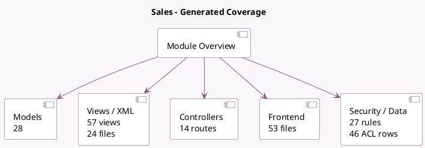

<!-- GENERATED:MODULE -->
---
tags: [odoo, community, module]
---

# Sales

- Scope: Community Addons
- Source: odoo/addons/sale
- Dependencies: [[docs/Community Addons/sales_team/sales_team|sales_team]], [[docs/Community Addons/account_payment/account_payment|account_payment]], [[docs/Community Addons/utm/utm|utm]]

## Summary

Sales internal machinery

## Generated coverage

- Models: 28
- XML files with UI/data artifacts: 24
- Views: 57
- Actions: 50
- Menus: 37
- Rules (ir.rule): 27
- Access CSV entries: 46
- Controller units: 4
- Frontend asset files: 53

## Module map

## Detail notes

- Models: [[docs/Community Addons/sale/Models|Models]] (28)
- Views and XML: [[docs/Community Addons/sale/Views|Views]] (24 files)
- Controllers: [[docs/Community Addons/sale/Controllers|Controllers]] (4)
- Frontend: [[docs/Community Addons/sale/Frontend|Frontend]] (53 files)

## Key models

- `account.analytic.applicability`
- `account.analytic.line`
- `account.chart.template`
- `account.invoice.report`
- `account.move`
- `account.move.line`
- `base.document.layout`
- `crm.team`
- `ir.actions.report`
- `ir.config_parameter`
- `payment.link.wizard`
- `payment.provider`

## Navigation

- [[../Community Addons/Community Addons|Back to scope]]
- [[../../docs/docs|Back to docs]]

<!-- GENERATED:MODULE -->

