<!-- GENERATED:MODEL -->
---
tags: [odoo, community, generated, model]
---

# crm.lead

- Module: [[docs/Community Addons/sale_crm/sale_crm|sale_crm]]
- Scope: Community Addons
- Defined in module: extension only
- Source files: `models/crm_lead.py`
- Python classes: `CrmLead`

## Field footprint

- Detected fields: 4
- Field types: `Integer` x 2, `Monetary` x 1, `One2many` x 1
- Relation fields: 1

## Sample fields

- `order_ids`: `One2many` (comodel `sale.order`)
- `quotation_count`: `Integer` (compute `_compute_sale_data`)
- `sale_amount_total`: `Monetary` (compute `_compute_sale_data`)
- `sale_order_count`: `Integer` (compute `_compute_sale_data`)

## Method hints

- Detected methods: 11
- Action methods: `action_new_quotation`, `action_sale_quotations_new`, `action_view_sale_order`, `action_view_sale_quotation`
- Compute methods: `_compute_sale_data`
- Onchange methods: none

## Direct relation diagram

```plantuml
@startuml
!define ODOO_COLOR_PRIMARY #714B67
!define ODOO_COLOR_ACCENT #875A7B
!define ODOO_COLOR_BG #FAF7FA

skinparam backgroundColor ODOO_COLOR_BG
skinparam defaultTextAlignment left
skinparam ArrowColor ODOO_COLOR_ACCENT
skinparam ClassBackgroundColor white
skinparam ClassBorderColor ODOO_COLOR_PRIMARY
skinparam ComponentBackgroundColor white
skinparam ComponentBorderColor ODOO_COLOR_PRIMARY
skinparam NoteBackgroundColor #FFF8FF
skinparam NoteBorderColor ODOO_COLOR_ACCENT
skinparam SequenceLifeLineBorderColor ODOO_COLOR_ACCENT
skinparam SequenceLifeLineBackgroundColor #FFFFFF
skinparam SequenceParticipantBorderColor ODOO_COLOR_PRIMARY
skinparam SequenceParticipantBackgroundColor #FFFFFF
skinparam sequence {
  ArrowColor ODOO_COLOR_ACCENT
  ActorBorderColor ODOO_COLOR_PRIMARY
}
title crm.lead - Direct Relations
class "crm.lead" as crm_lead
class "sale.order" as sale_order
crm_lead --|> sale_order : order_ids
@enduml
```

## Navigation

- **Parent:** [[docs/Community Addons/sale_crm/Models]]

<!-- GENERATED:MODEL -->
