<!-- GENERATED:MODEL -->
---
tags: [odoo, community, generated, model]
---

# hr.expense.split

- Module: [[docs/Community Addons/sale_expense/sale_expense|sale_expense]]
- Scope: Community Addons
- Defined in module: extension only
- Source files: `models/hr_expense_split.py`
- Python classes: `HrExpenseSplit`

## Field footprint

- Detected fields: 2
- Field types: `Boolean` x 1, `Many2one` x 1
- Relation fields: 1

## Sample fields

- `can_be_reinvoiced`: `Boolean` (comodel `Can be reinvoiced`, compute `_compute_can_be_reinvoiced`)
- `sale_order_id`: `Many2one` (comodel `sale.order`, compute `_compute_sale_order_id`, store `True`)

## Method hints

- Detected methods: 3
- Action methods: none
- Compute methods: `_compute_can_be_reinvoiced`, `_compute_sale_order_id`
- Onchange methods: none

## Direct relation diagram

```plantuml
@startuml
!define ODOO_COLOR_PRIMARY #714B67
!define ODOO_COLOR_ACCENT #875A7B
!define ODOO_COLOR_BG #FAF7FA

skinparam backgroundColor ODOO_COLOR_BG
skinparam defaultTextAlignment left
skinparam ArrowColor ODOO_COLOR_ACCENT
skinparam ClassBackgroundColor white
skinparam ClassBorderColor ODOO_COLOR_PRIMARY
skinparam ComponentBackgroundColor white
skinparam ComponentBorderColor ODOO_COLOR_PRIMARY
skinparam NoteBackgroundColor #FFF8FF
skinparam NoteBorderColor ODOO_COLOR_ACCENT
skinparam SequenceLifeLineBorderColor ODOO_COLOR_ACCENT
skinparam SequenceLifeLineBackgroundColor #FFFFFF
skinparam SequenceParticipantBorderColor ODOO_COLOR_PRIMARY
skinparam SequenceParticipantBackgroundColor #FFFFFF
skinparam sequence {
  ArrowColor ODOO_COLOR_ACCENT
  ActorBorderColor ODOO_COLOR_PRIMARY
}
title hr.expense.split - Direct Relations
class "hr.expense.split" as hr_expense_split
class "sale.order" as sale_order
hr_expense_split --> sale_order : sale_order_id
@enduml
```

## Navigation

- **Parent:** [[docs/Community Addons/sale_expense/Models]]

<!-- GENERATED:MODEL -->
