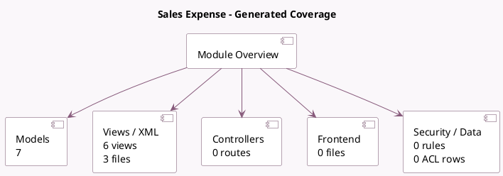

<!-- GENERATED:MODULE -->
---
tags: [odoo, community, module]
---

# Sales Expense

- Scope: Community Addons
- Source: odoo/addons/sale_expense
- Dependencies: [[docs/Community Addons/sale_management/sale_management|sale_management]], [[docs/Community Addons/hr_expense/hr_expense|hr_expense]]

## Summary

Quotation, Sales Orders, Delivery & Invoicing Control

## Generated coverage

- Models: 7
- XML files with UI/data artifacts: 3
- Views: 6
- Actions: 2
- Menus: 0
- Rules (ir.rule): 0
- Access CSV entries: 0
- Controller units: 0
- Frontend asset files: 0

## Module map

## Detail notes

- Models: [[docs/Community Addons/sale_expense/Models|Models]] (7)
- Views and XML: [[docs/Community Addons/sale_expense/Views|Views]] (3 files)

## Key models

- `account.move`
- `account.move.line`
- `hr.expense`
- `hr.expense.split`
- `product.template`
- `sale.order`
- `sale.order.line`

## Navigation

- [[../Community Addons/Community Addons|Back to scope]]
- [[../../docs/docs|Back to docs]]

<!-- GENERATED:MODULE -->

