<!-- GENERATED:MODEL -->
---
tags: [odoo, community, generated, model]
---

# product.template

- Module: [[docs/Community Addons/sale_gelato/sale_gelato|sale_gelato]]
- Scope: Community Addons
- Defined in module: extension only
- Source files: `models/product_template.py`
- Python classes: `ProductTemplate`

## Field footprint

- Detected fields: 4
- Field types: `Boolean` x 1, `Char` x 2, `One2many` x 1
- Relation fields: 1

## Sample fields

- `gelato_image_ids`: `One2many` (comodel `product.document`)
- `gelato_missing_images`: `Boolean` (compute `_compute_gelato_missing_images`)
- `gelato_product_uid`: `Char` (compute `_compute_gelato_product_uid`)
- `gelato_template_ref`: `Char`

## Method hints

- Detected methods: 8
- Action methods: `action_sync_gelato_template_info`
- Compute methods: `_compute_gelato_missing_images`, `_compute_gelato_product_uid`
- Onchange methods: none

## Direct relation diagram

```plantuml
@startuml
!define ODOO_COLOR_PRIMARY #714B67
!define ODOO_COLOR_ACCENT #875A7B
!define ODOO_COLOR_BG #FAF7FA

skinparam backgroundColor ODOO_COLOR_BG
skinparam defaultTextAlignment left
skinparam ArrowColor ODOO_COLOR_ACCENT
skinparam ClassBackgroundColor white
skinparam ClassBorderColor ODOO_COLOR_PRIMARY
skinparam ComponentBackgroundColor white
skinparam ComponentBorderColor ODOO_COLOR_PRIMARY
skinparam NoteBackgroundColor #FFF8FF
skinparam NoteBorderColor ODOO_COLOR_ACCENT
skinparam SequenceLifeLineBorderColor ODOO_COLOR_ACCENT
skinparam SequenceLifeLineBackgroundColor #FFFFFF
skinparam SequenceParticipantBorderColor ODOO_COLOR_PRIMARY
skinparam SequenceParticipantBackgroundColor #FFFFFF
skinparam sequence {
  ArrowColor ODOO_COLOR_ACCENT
  ActorBorderColor ODOO_COLOR_PRIMARY
}
title product.template - Direct Relations
class "product.template" as product_template
class "product.document" as product_document
product_template --|> product_document : gelato_image_ids
@enduml
```

## Navigation

- **Parent:** [[docs/Community Addons/sale_gelato/Models]]

<!-- GENERATED:MODEL -->
