<!-- GENERATED:MODEL -->
---
tags: [odoo, community, generated, model]
---

# sale.loyalty.reward.wizard

- Module: [[docs/Community Addons/sale_loyalty/sale_loyalty|sale_loyalty]]
- Scope: Community Addons
- Defined in module: yes
- Source files: `wizard/sale_loyalty_reward_wizard.py`
- Python classes: `SaleLoyaltyRewardWizard`
- Description: Sale Loyalty - Reward Selection Wizard

## Field footprint

- Detected fields: 6
- Field types: `Boolean` x 1, `Many2many` x 2, `Many2one` x 3
- Relation fields: 5

## Sample fields

- `multi_product_reward`: `Boolean` (related `selected_reward_id.multi_product`)
- `order_id`: `Many2one` (comodel `sale.order`)
- `reward_ids`: `Many2many` (comodel `loyalty.reward`, compute `_compute_claimable_reward_ids`)
- `reward_product_ids`: `Many2many` (related `selected_reward_id.reward_product_ids`)
- `selected_product_id`: `Many2one` (comodel `product.product`, compute `_compute_selected_product_id`, store `True`)
- `selected_reward_id`: `Many2one` (comodel `loyalty.reward`)

## Method hints

- Detected methods: 3
- Action methods: `action_apply`
- Compute methods: `_compute_claimable_reward_ids`, `_compute_selected_product_id`
- Onchange methods: none

## Direct relation diagram

```plantuml
@startuml
!define ODOO_COLOR_PRIMARY #714B67
!define ODOO_COLOR_ACCENT #875A7B
!define ODOO_COLOR_BG #FAF7FA

skinparam backgroundColor ODOO_COLOR_BG
skinparam defaultTextAlignment left
skinparam ArrowColor ODOO_COLOR_ACCENT
skinparam ClassBackgroundColor white
skinparam ClassBorderColor ODOO_COLOR_PRIMARY
skinparam ComponentBackgroundColor white
skinparam ComponentBorderColor ODOO_COLOR_PRIMARY
skinparam NoteBackgroundColor #FFF8FF
skinparam NoteBorderColor ODOO_COLOR_ACCENT
skinparam SequenceLifeLineBorderColor ODOO_COLOR_ACCENT
skinparam SequenceLifeLineBackgroundColor #FFFFFF
skinparam SequenceParticipantBorderColor ODOO_COLOR_PRIMARY
skinparam SequenceParticipantBackgroundColor #FFFFFF
skinparam sequence {
  ArrowColor ODOO_COLOR_ACCENT
  ActorBorderColor ODOO_COLOR_PRIMARY
}
title sale.loyalty.reward.wizard - Direct Relations
class "sale.loyalty.reward.wizard" as sale_loyalty_reward_wizard
class "loyalty.reward" as loyalty_reward
class "product.product" as product_product
class "sale.order" as sale_order
sale_loyalty_reward_wizard --> sale_order : order_id
sale_loyalty_reward_wizard .. loyalty_reward : reward_ids
sale_loyalty_reward_wizard --> loyalty_reward : selected_reward_id
sale_loyalty_reward_wizard --> product_product : selected_product_id
@enduml
```

## Navigation

- **Parent:** [[docs/Community Addons/sale_loyalty/Models]]

<!-- GENERATED:MODEL -->
