<!-- GENERATED:MODEL -->
---
tags: [odoo, community, generated, model]
---

# sale.order.coupon.points

- Module: [[docs/Community Addons/sale_loyalty/sale_loyalty|sale_loyalty]]
- Scope: Community Addons
- Defined in module: yes
- Source files: `models/sale_order_coupon_points.py`
- Python classes: `SaleOrderCouponPoints`
- Description: Sale Order Coupon Points - Keeps track of how a sale order impacts a coupon

## Field footprint

- Detected fields: 3
- Field types: `Float` x 1, `Many2one` x 2
- Relation fields: 2

## Sample fields

- `coupon_id`: `Many2one` (comodel `loyalty.card`)
- `order_id`: `Many2one` (comodel `sale.order`)
- `points`: `Float`

## Method hints

- Detected methods: 0
- Action methods: none
- Compute methods: none
- Onchange methods: none

## Direct relation diagram

```plantuml
@startuml
!define ODOO_COLOR_PRIMARY #714B67
!define ODOO_COLOR_ACCENT #875A7B
!define ODOO_COLOR_BG #FAF7FA

skinparam backgroundColor ODOO_COLOR_BG
skinparam defaultTextAlignment left
skinparam ArrowColor ODOO_COLOR_ACCENT
skinparam ClassBackgroundColor white
skinparam ClassBorderColor ODOO_COLOR_PRIMARY
skinparam ComponentBackgroundColor white
skinparam ComponentBorderColor ODOO_COLOR_PRIMARY
skinparam NoteBackgroundColor #FFF8FF
skinparam NoteBorderColor ODOO_COLOR_ACCENT
skinparam SequenceLifeLineBorderColor ODOO_COLOR_ACCENT
skinparam SequenceLifeLineBackgroundColor #FFFFFF
skinparam SequenceParticipantBorderColor ODOO_COLOR_PRIMARY
skinparam SequenceParticipantBackgroundColor #FFFFFF
skinparam sequence {
  ArrowColor ODOO_COLOR_ACCENT
  ActorBorderColor ODOO_COLOR_PRIMARY
}
title sale.order.coupon.points - Direct Relations
class "sale.order.coupon.points" as sale_order_coupon_points
class "loyalty.card" as loyalty_card
class "sale.order" as sale_order
sale_order_coupon_points --> sale_order : order_id
sale_order_coupon_points --> loyalty_card : coupon_id
@enduml
```

## Navigation

- **Parent:** [[docs/Community Addons/sale_loyalty/Models]]

<!-- GENERATED:MODEL -->
