<!-- GENERATED:MODEL -->
---
tags: [odoo, community, generated, model]
---

# sale.order

- Module: [[docs/Community Addons/sale_loyalty/sale_loyalty|sale_loyalty]]
- Scope: Community Addons
- Defined in module: extension only
- Source files: `models/sale_order.py`
- Python classes: `SaleOrder`

## Field footprint

- Detected fields: 6
- Field types: `Float` x 1, `Integer` x 1, `Json` x 1, `Many2many` x 2, `One2many` x 1
- Relation fields: 3

## Sample fields

- `applied_coupon_ids`: `Many2many` (comodel `loyalty.card`)
- `code_enabled_rule_ids`: `Many2many` (comodel `loyalty.rule`)
- `coupon_point_ids`: `One2many` (comodel `sale.order.coupon.points`)
- `gift_card_count`: `Integer` (compute `_compute_gift_card_count`)
- `loyalty_data`: `Json` (compute `_compute_loyalty_data`)
- `reward_amount`: `Float` (compute `_compute_reward_total`)

## Method hints

- Detected methods: 49
- Action methods: `action_confirm`, `action_open_reward_wizard`, `action_view_gift_cards`
- Compute methods: `_compute_gift_card_count`, `_compute_loyalty_data`, `_compute_reward_total`
- Onchange methods: none

## Direct relation diagram

```plantuml
@startuml
!define ODOO_COLOR_PRIMARY #714B67
!define ODOO_COLOR_ACCENT #875A7B
!define ODOO_COLOR_BG #FAF7FA

skinparam backgroundColor ODOO_COLOR_BG
skinparam defaultTextAlignment left
skinparam ArrowColor ODOO_COLOR_ACCENT
skinparam ClassBackgroundColor white
skinparam ClassBorderColor ODOO_COLOR_PRIMARY
skinparam ComponentBackgroundColor white
skinparam ComponentBorderColor ODOO_COLOR_PRIMARY
skinparam NoteBackgroundColor #FFF8FF
skinparam NoteBorderColor ODOO_COLOR_ACCENT
skinparam SequenceLifeLineBorderColor ODOO_COLOR_ACCENT
skinparam SequenceLifeLineBackgroundColor #FFFFFF
skinparam SequenceParticipantBorderColor ODOO_COLOR_PRIMARY
skinparam SequenceParticipantBackgroundColor #FFFFFF
skinparam sequence {
  ArrowColor ODOO_COLOR_ACCENT
  ActorBorderColor ODOO_COLOR_PRIMARY
}
title sale.order - Direct Relations
class "sale.order" as sale_order
class "loyalty.card" as loyalty_card
class "loyalty.rule" as loyalty_rule
class "sale.order.coupon.points" as sale_order_coupon_points
sale_order .. loyalty_card : applied_coupon_ids
sale_order .. loyalty_rule : code_enabled_rule_ids
sale_order --|> sale_order_coupon_points : coupon_point_ids
@enduml
```

## Navigation

- **Parent:** [[docs/Community Addons/sale_loyalty/Models]]

<!-- GENERATED:MODEL -->
