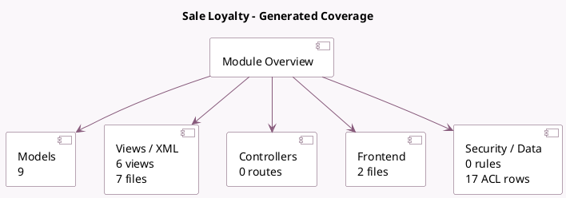

<!-- GENERATED:MODULE -->
---
tags: [odoo, community, module]
---

# Sale Loyalty

- Scope: Community Addons
- Source: odoo/addons/sale_loyalty
- Dependencies: [[docs/Community Addons/sale/sale|sale]], [[docs/Community Addons/loyalty/loyalty|loyalty]]

## Summary

Use discounts and loyalty programs in sales orders

## Generated coverage

- Models: 9
- XML files with UI/data artifacts: 7
- Views: 6
- Actions: 2
- Menus: 2
- Rules (ir.rule): 0
- Access CSV entries: 17
- Controller units: 0
- Frontend asset files: 2

## Module map

## Detail notes

- Models: [[docs/Community Addons/sale_loyalty/Models|Models]] (9)
- Views and XML: [[docs/Community Addons/sale_loyalty/Views|Views]] (7 files)
- Frontend: [[docs/Community Addons/sale_loyalty/Frontend|Frontend]] (2 files)

## Key models

- `loyalty.card`
- `loyalty.history`
- `loyalty.program`
- `loyalty.reward`
- `sale.loyalty.coupon.wizard`
- `sale.loyalty.reward.wizard`
- `sale.order`
- `sale.order.coupon.points`
- `sale.order.line`

## Navigation

- [[../Community Addons/Community Addons|Back to scope]]
- [[../../docs/docs|Back to docs]]

<!-- GENERATED:MODULE -->

