<!-- GENERATED:MODEL -->
---
tags: [odoo, community, generated, model]
---

# sale.order

- Module: [[docs/Community Addons/sale_management/sale_management|sale_management]]
- Scope: Community Addons
- Defined in module: extension only
- Source files: `models/sale_order.py`
- Python classes: `SaleOrder`

## Field footprint

- Detected fields: 1
- Field types: `Many2one` x 1
- Relation fields: 1

## Sample fields

- `sale_order_template_id`: `Many2one` (comodel `sale.order.template`, compute `_compute_sale_order_template_id`, store `True`)

## Method hints

- Detected methods: 12
- Action methods: `action_confirm`
- Compute methods: `_compute_journal_id`, `_compute_note`, `_compute_prepayment_percent`, `_compute_require_payment`, `_compute_require_signature`, `_compute_sale_order_template_id`, `_compute_validity_date`
- Onchange methods: `_onchange_company_id`, `_onchange_partner_id`, `_onchange_sale_order_template_id`

## Direct relation diagram

```plantuml
@startuml
!define ODOO_COLOR_PRIMARY #714B67
!define ODOO_COLOR_ACCENT #875A7B
!define ODOO_COLOR_BG #FAF7FA

skinparam backgroundColor ODOO_COLOR_BG
skinparam defaultTextAlignment left
skinparam ArrowColor ODOO_COLOR_ACCENT
skinparam ClassBackgroundColor white
skinparam ClassBorderColor ODOO_COLOR_PRIMARY
skinparam ComponentBackgroundColor white
skinparam ComponentBorderColor ODOO_COLOR_PRIMARY
skinparam NoteBackgroundColor #FFF8FF
skinparam NoteBorderColor ODOO_COLOR_ACCENT
skinparam SequenceLifeLineBorderColor ODOO_COLOR_ACCENT
skinparam SequenceLifeLineBackgroundColor #FFFFFF
skinparam SequenceParticipantBorderColor ODOO_COLOR_PRIMARY
skinparam SequenceParticipantBackgroundColor #FFFFFF
skinparam sequence {
  ArrowColor ODOO_COLOR_ACCENT
  ActorBorderColor ODOO_COLOR_PRIMARY
}
title sale.order - Direct Relations
class "sale.order" as sale_order
class "sale.order.template" as sale_order_template
sale_order --> sale_order_template : sale_order_template_id
@enduml
```

## Navigation

- **Parent:** [[docs/Community Addons/sale_management/Models]]

<!-- GENERATED:MODEL -->
