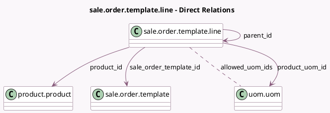

<!-- GENERATED:MODEL -->
---
tags: [odoo, community, generated, model]
---

# sale.order.template.line

- Module: [[docs/Community Addons/sale_management/sale_management|sale_management]]
- Scope: Community Addons
- Defined in module: yes
- Source files: `models/sale_order_template_line.py`
- Python classes: `SaleOrderTemplateLine`
- Description: Quotation Template Line

## Field footprint

- Detected fields: 11
- Field types: `Boolean` x 1, `Float` x 1, `Integer` x 1, `Many2many` x 1, `Many2one` x 5, `Selection` x 1, `Text` x 1
- Relation fields: 6

## Sample fields

- `allowed_uom_ids`: `Many2many` (comodel `uom.uom`, compute `_compute_allowed_uom_ids`)
- `company_id`: `Many2one` (related `sale_order_template_id.company_id`, store `True`)
- `display_type`: `Selection`
- `is_optional`: `Boolean`
- `name`: `Text`
- `parent_id`: `Many2one` (comodel `sale.order.template.line`, compute `_compute_parent_id`)
- `product_id`: `Many2one` (comodel `product.product`)
- `product_uom_id`: `Many2one` (comodel `uom.uom`, compute `_compute_product_uom_id`, store `True`)
- `product_uom_qty`: `Float`
- `sale_order_template_id`: `Many2one` (comodel `sale.order.template`)
- `sequence`: `Integer`

## Method hints

- Detected methods: 7
- Action methods: none
- Compute methods: `_compute_allowed_uom_ids`, `_compute_parent_id`, `_compute_product_uom_id`
- Onchange methods: none

## Direct relation diagram

## Navigation

- **Parent:** [[docs/Community Addons/sale_management/Models]]

<!-- GENERATED:MODEL -->
