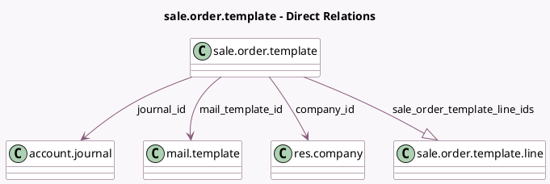

<!-- GENERATED:MODEL -->
---
tags: [odoo, community, generated, model]
---

# sale.order.template

- Module: [[docs/Community Addons/sale_management/sale_management|sale_management]]
- Scope: Community Addons
- Defined in module: yes
- Source files: `models/sale_order_template.py`
- Python classes: `SaleOrderTemplate`
- Description: Quotation Template

## Field footprint

- Detected fields: 12
- Field types: `Boolean` x 3, `Char` x 1, `Float` x 1, `Html` x 1, `Integer` x 2, `Many2one` x 3, `One2many` x 1
- Relation fields: 4

## Sample fields

- `active`: `Boolean`
- `company_id`: `Many2one` (comodel `res.company`)
- `journal_id`: `Many2one` (comodel `account.journal`)
- `mail_template_id`: `Many2one` (comodel `mail.template`)
- `name`: `Char`
- `note`: `Html`
- `number_of_days`: `Integer`
- `prepayment_percent`: `Float` (compute `_compute_prepayment_percent`, store `True`)
- `require_payment`: `Boolean` (compute `_compute_require_payment`, store `True`)
- `require_signature`: `Boolean` (compute `_compute_require_signature`, store `True`)
- `sale_order_template_line_ids`: `One2many` (comodel `sale.order.template.line`)
- `sequence`: `Integer`

## Method hints

- Detected methods: 10
- Action methods: none
- Compute methods: `_compute_prepayment_percent`, `_compute_require_payment`, `_compute_require_signature`
- Onchange methods: `_onchange_prepayment_percent`

## Direct relation diagram

## Navigation

- **Parent:** [[docs/Community Addons/sale_management/Models]]

<!-- GENERATED:MODEL -->
