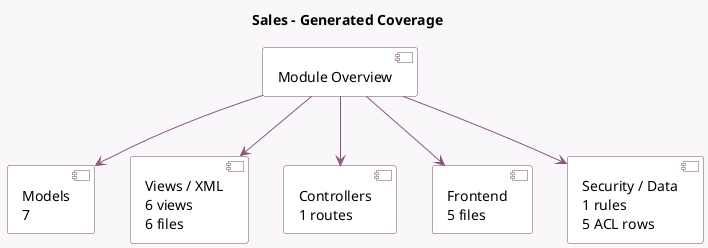

<!-- GENERATED:MODULE -->
---
tags: [odoo, community, module]
---

# Sales

- Scope: Community Addons
- Source: odoo/addons/sale_management
- Dependencies: [[docs/Community Addons/sale/sale|sale]], [[docs/Community Addons/digest/digest|digest]]

## Summary

From quotations to invoices

## Generated coverage

- Models: 7
- XML files with UI/data artifacts: 6
- Views: 6
- Actions: 1
- Menus: 2
- Rules (ir.rule): 1
- Access CSV entries: 5
- Controller units: 1
- Frontend asset files: 5

## Module map

## Detail notes

- Models: [[docs/Community Addons/sale_management/Models|Models]] (7)
- Views and XML: [[docs/Community Addons/sale_management/Views|Views]] (6 files)
- Controllers: [[docs/Community Addons/sale_management/Controllers|Controllers]] (1)
- Frontend: [[docs/Community Addons/sale_management/Frontend|Frontend]] (5 files)

## Key models

- `digest.digest`
- `res.company`
- `res.config.settings`
- `sale.order`
- `sale.order.line`
- `sale.order.template`
- `sale.order.template.line`

## Navigation

- [[../Community Addons/Community Addons|Back to scope]]
- [[../../docs/docs|Back to docs]]

<!-- GENERATED:MODULE -->

## Curated analysis

### Functional role
- Turns the lower-level `sale` module into the app-facing sales workspace with quotation templates, digest metrics, and portal refinements for commercial teams.
- The dedicated template models let teams standardize optional products, descriptions, and invoicing defaults before an order is confirmed.

### Operational footprint
- Core logic lives in `sale_order.py`, `sale_order_line.py`, and the template models; these files shape how commercial defaults reach the quotation.
- Security is not trivial: `security/sale_management_security.xml` adds a template-specific group and company rule, while portal templates extend the customer-facing order review.

### Evidence
- Source files: `odoo19/addons/sale_management/models/sale_order.py`, `odoo19/addons/sale_management/models/sale_order_template.py`, `odoo19/addons/sale_management/models/res_config_settings.py`
- UI and security: `odoo19/addons/sale_management/views/sale_order_template_views.xml`, `odoo19/addons/sale_management/views/sale_order_views.xml`, `odoo19/addons/sale_management/security/sale_management_security.xml`
- Tests: `odoo19/addons/sale_management/tests/test_sale_order.py`, `odoo19/addons/sale_management/tests/test_sale_ui.py`

### Related notes
- `[[docs/Community Addons/sale/sale|sale]]`
- `[[docs/Community Addons/website_sale/website_sale|website_sale]]`

### Risks and follow-up
- Template-heavy deployments need strong pricing governance because pricelists, optional products, and journal defaults interact before the user notices inconsistencies.
- Portal customizations should be validated together with `website_sale` and payment flows when the sales channel is public-facing.
- Legacy comparison backlog was retired on 2026-03-02; keep this note focused on the current codebase.

