<!-- GENERATED:MODEL -->
---
tags: [odoo, community, generated, model]
---

# mrp.production

- Module: [[docs/Community Addons/sale_mrp/sale_mrp|sale_mrp]]
- Scope: Community Addons
- Defined in module: extension only
- Source files: `models/mrp_production.py`
- Python classes: `MrpProduction`

## Field footprint

- Detected fields: 2
- Field types: `Integer` x 1, `Many2one` x 1
- Relation fields: 1

## Sample fields

- `sale_line_id`: `Many2one` (comodel `sale.order.line`)
- `sale_order_count`: `Integer` (comodel `Count of Source SO`, compute `_compute_sale_order_count`)

## Method hints

- Detected methods: 3
- Action methods: `action_confirm`, `action_view_sale_orders`
- Compute methods: `_compute_sale_order_count`
- Onchange methods: none

## Direct relation diagram

```plantuml
@startuml
!define ODOO_COLOR_PRIMARY #714B67
!define ODOO_COLOR_ACCENT #875A7B
!define ODOO_COLOR_BG #FAF7FA

skinparam backgroundColor ODOO_COLOR_BG
skinparam defaultTextAlignment left
skinparam ArrowColor ODOO_COLOR_ACCENT
skinparam ClassBackgroundColor white
skinparam ClassBorderColor ODOO_COLOR_PRIMARY
skinparam ComponentBackgroundColor white
skinparam ComponentBorderColor ODOO_COLOR_PRIMARY
skinparam NoteBackgroundColor #FFF8FF
skinparam NoteBorderColor ODOO_COLOR_ACCENT
skinparam SequenceLifeLineBorderColor ODOO_COLOR_ACCENT
skinparam SequenceLifeLineBackgroundColor #FFFFFF
skinparam SequenceParticipantBorderColor ODOO_COLOR_PRIMARY
skinparam SequenceParticipantBackgroundColor #FFFFFF
skinparam sequence {
  ArrowColor ODOO_COLOR_ACCENT
  ActorBorderColor ODOO_COLOR_PRIMARY
}
title mrp.production - Direct Relations
class "mrp.production" as mrp_production
class "sale.order.line" as sale_order_line
mrp_production --> sale_order_line : sale_line_id
@enduml
```

## Navigation

- **Parent:** [[docs/Community Addons/sale_mrp/Models]]

<!-- GENERATED:MODEL -->
