<!-- GENERATED:MODEL -->
---
tags: [odoo, community, generated, model]
---

# sale.order

- Module: [[docs/Community Addons/sale_mrp/sale_mrp|sale_mrp]]
- Scope: Community Addons
- Defined in module: extension only
- Source files: `models/sale_order.py`
- Python classes: `SaleOrder`

## Field footprint

- Detected fields: 2
- Field types: `Integer` x 1, `Many2many` x 1
- Relation fields: 1

## Sample fields

- `mrp_production_count`: `Integer` (comodel `Count of MO generated`, compute `_compute_mrp_production_ids`)
- `mrp_production_ids`: `Many2many` (comodel `mrp.production`, compute `_compute_mrp_production_ids`)

## Method hints

- Detected methods: 2
- Action methods: `action_view_mrp_production`
- Compute methods: `_compute_mrp_production_ids`
- Onchange methods: none

## Direct relation diagram

```plantuml
@startuml
!define ODOO_COLOR_PRIMARY #714B67
!define ODOO_COLOR_ACCENT #875A7B
!define ODOO_COLOR_BG #FAF7FA

skinparam backgroundColor ODOO_COLOR_BG
skinparam defaultTextAlignment left
skinparam ArrowColor ODOO_COLOR_ACCENT
skinparam ClassBackgroundColor white
skinparam ClassBorderColor ODOO_COLOR_PRIMARY
skinparam ComponentBackgroundColor white
skinparam ComponentBorderColor ODOO_COLOR_PRIMARY
skinparam NoteBackgroundColor #FFF8FF
skinparam NoteBorderColor ODOO_COLOR_ACCENT
skinparam SequenceLifeLineBorderColor ODOO_COLOR_ACCENT
skinparam SequenceLifeLineBackgroundColor #FFFFFF
skinparam SequenceParticipantBorderColor ODOO_COLOR_PRIMARY
skinparam SequenceParticipantBackgroundColor #FFFFFF
skinparam sequence {
  ArrowColor ODOO_COLOR_ACCENT
  ActorBorderColor ODOO_COLOR_PRIMARY
}
title sale.order - Direct Relations
class "sale.order" as sale_order
class "mrp.production" as mrp_production
sale_order .. mrp_production : mrp_production_ids
@enduml
```

## Navigation

- **Parent:** [[docs/Community Addons/sale_mrp/Models]]

<!-- GENERATED:MODEL -->
