<!-- GENERATED:MODEL -->
---
tags: [odoo, community, generated, model]
---

# product.document

- Module: [[docs/Community Addons/sale_pdf_quote_builder/sale_pdf_quote_builder|sale_pdf_quote_builder]]
- Scope: Community Addons
- Defined in module: extension only
- Source files: `models/product_document.py`
- Python classes: `ProductDocument`

## Field footprint

- Detected fields: 2
- Field types: `Many2many` x 1, `Selection` x 1
- Relation fields: 1

## Sample fields

- `attached_on_sale`: `Selection`
- `form_field_ids`: `Many2many` (comodel `sale.pdf.form.field`, compute `_compute_form_field_ids`, store `True`)

## Method hints

- Detected methods: 3
- Action methods: `action_open_pdf_form_fields`
- Compute methods: `_compute_form_field_ids`
- Onchange methods: none

## Direct relation diagram

```plantuml
@startuml
!define ODOO_COLOR_PRIMARY #714B67
!define ODOO_COLOR_ACCENT #875A7B
!define ODOO_COLOR_BG #FAF7FA

skinparam backgroundColor ODOO_COLOR_BG
skinparam defaultTextAlignment left
skinparam ArrowColor ODOO_COLOR_ACCENT
skinparam ClassBackgroundColor white
skinparam ClassBorderColor ODOO_COLOR_PRIMARY
skinparam ComponentBackgroundColor white
skinparam ComponentBorderColor ODOO_COLOR_PRIMARY
skinparam NoteBackgroundColor #FFF8FF
skinparam NoteBorderColor ODOO_COLOR_ACCENT
skinparam SequenceLifeLineBorderColor ODOO_COLOR_ACCENT
skinparam SequenceLifeLineBackgroundColor #FFFFFF
skinparam SequenceParticipantBorderColor ODOO_COLOR_PRIMARY
skinparam SequenceParticipantBackgroundColor #FFFFFF
skinparam sequence {
  ArrowColor ODOO_COLOR_ACCENT
  ActorBorderColor ODOO_COLOR_PRIMARY
}
title product.document - Direct Relations
class "product.document" as product_document
class "sale.pdf.form.field" as sale_pdf_form_field
product_document .. sale_pdf_form_field : form_field_ids
@enduml
```

## Navigation

- **Parent:** [[docs/Community Addons/sale_pdf_quote_builder/Models]]

<!-- GENERATED:MODEL -->
