<!-- GENERATED:MODEL -->
---
tags: [odoo, community, generated, model]
---

# quotation.document

- Module: [[docs/Community Addons/sale_pdf_quote_builder/sale_pdf_quote_builder|sale_pdf_quote_builder]]
- Scope: Community Addons
- Defined in module: yes
- Source files: `models/quotation_document.py`
- Python classes: `QuotationDocument`
- Description: Quotation's Headers & Footers

## Field footprint

- Detected fields: 7
- Field types: `Boolean` x 2, `Integer` x 1, `Many2many` x 2, `Many2one` x 1, `Selection` x 1
- Relation fields: 3

## Sample fields

- `active`: `Boolean`
- `add_by_default`: `Boolean`
- `document_type`: `Selection`
- `form_field_ids`: `Many2many` (comodel `sale.pdf.form.field`, compute `_compute_form_field_ids`, store `True`)
- `ir_attachment_id`: `Many2one` (comodel `ir.attachment`)
- `quotation_template_ids`: `Many2many` (comodel `sale.order.template`)
- `sequence`: `Integer`

## Method hints

- Detected methods: 4
- Action methods: `action_open_pdf_form_fields`
- Compute methods: `_compute_form_field_ids`
- Onchange methods: none

## Direct relation diagram

```plantuml
@startuml
!define ODOO_COLOR_PRIMARY #714B67
!define ODOO_COLOR_ACCENT #875A7B
!define ODOO_COLOR_BG #FAF7FA

skinparam backgroundColor ODOO_COLOR_BG
skinparam defaultTextAlignment left
skinparam ArrowColor ODOO_COLOR_ACCENT
skinparam ClassBackgroundColor white
skinparam ClassBorderColor ODOO_COLOR_PRIMARY
skinparam ComponentBackgroundColor white
skinparam ComponentBorderColor ODOO_COLOR_PRIMARY
skinparam NoteBackgroundColor #FFF8FF
skinparam NoteBorderColor ODOO_COLOR_ACCENT
skinparam SequenceLifeLineBorderColor ODOO_COLOR_ACCENT
skinparam SequenceLifeLineBackgroundColor #FFFFFF
skinparam SequenceParticipantBorderColor ODOO_COLOR_PRIMARY
skinparam SequenceParticipantBackgroundColor #FFFFFF
skinparam sequence {
  ArrowColor ODOO_COLOR_ACCENT
  ActorBorderColor ODOO_COLOR_PRIMARY
}
title quotation.document - Direct Relations
class "quotation.document" as quotation_document
class "ir.attachment" as ir_attachment
class "sale.order.template" as sale_order_template
class "sale.pdf.form.field" as sale_pdf_form_field
quotation_document --> ir_attachment : ir_attachment_id
quotation_document .. sale_order_template : quotation_template_ids
quotation_document .. sale_pdf_form_field : form_field_ids
@enduml
```

## Navigation

- **Parent:** [[docs/Community Addons/sale_pdf_quote_builder/Models]]

<!-- GENERATED:MODEL -->
