<!-- GENERATED:MODEL -->
---
tags: [odoo, community, generated, model]
---

# sale.order

- Module: [[docs/Community Addons/sale_pdf_quote_builder/sale_pdf_quote_builder|sale_pdf_quote_builder]]
- Scope: Community Addons
- Defined in module: extension only
- Source files: `models/sale_order.py`
- Python classes: `SaleOrder`

## Field footprint

- Detected fields: 4
- Field types: `Boolean` x 1, `Json` x 1, `Many2many` x 2
- Relation fields: 2

## Sample fields

- `available_quotation_document_ids`: `Many2many` (comodel `quotation.document`, compute `_compute_available_quotation_document_ids`)
- `customizable_pdf_form_fields`: `Json`
- `is_pdf_quote_builder_available`: `Boolean` (compute `_compute_is_pdf_quote_builder_available`)
- `quotation_document_ids`: `Many2many` (comodel `quotation.document`)

## Method hints

- Detected methods: 5
- Action methods: none
- Compute methods: `_compute_available_quotation_document_ids`, `_compute_is_pdf_quote_builder_available`
- Onchange methods: `_onchange_sale_order_template_id`

## Direct relation diagram

```plantuml
@startuml
!define ODOO_COLOR_PRIMARY #714B67
!define ODOO_COLOR_ACCENT #875A7B
!define ODOO_COLOR_BG #FAF7FA

skinparam backgroundColor ODOO_COLOR_BG
skinparam defaultTextAlignment left
skinparam ArrowColor ODOO_COLOR_ACCENT
skinparam ClassBackgroundColor white
skinparam ClassBorderColor ODOO_COLOR_PRIMARY
skinparam ComponentBackgroundColor white
skinparam ComponentBorderColor ODOO_COLOR_PRIMARY
skinparam NoteBackgroundColor #FFF8FF
skinparam NoteBorderColor ODOO_COLOR_ACCENT
skinparam SequenceLifeLineBorderColor ODOO_COLOR_ACCENT
skinparam SequenceLifeLineBackgroundColor #FFFFFF
skinparam SequenceParticipantBorderColor ODOO_COLOR_PRIMARY
skinparam SequenceParticipantBackgroundColor #FFFFFF
skinparam sequence {
  ArrowColor ODOO_COLOR_ACCENT
  ActorBorderColor ODOO_COLOR_PRIMARY
}
title sale.order - Direct Relations
class "sale.order" as sale_order
class "quotation.document" as quotation_document
sale_order .. quotation_document : available_quotation_document_ids
sale_order .. quotation_document : quotation_document_ids
@enduml
```

## Navigation

- **Parent:** [[docs/Community Addons/sale_pdf_quote_builder/Models]]

<!-- GENERATED:MODEL -->
