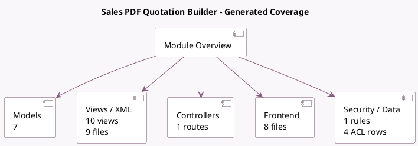

<!-- GENERATED:MODULE -->
---
tags: [odoo, community, module]
---

# Sales PDF Quotation Builder

- Scope: Community Addons
- Source: odoo/addons/sale_pdf_quote_builder
- Dependencies: [[docs/Community Addons/sale_management/sale_management|sale_management]]

## Generated coverage

- Models: 7
- XML files with UI/data artifacts: 9
- Views: 10
- Actions: 3
- Menus: 1
- Rules (ir.rule): 1
- Access CSV entries: 4
- Controller units: 1
- Frontend asset files: 8

## Module map

## Detail notes

- Models: [[docs/Community Addons/sale_pdf_quote_builder/Models|Models]] (7)
- Views and XML: [[docs/Community Addons/sale_pdf_quote_builder/Views|Views]] (9 files)
- Controllers: [[docs/Community Addons/sale_pdf_quote_builder/Controllers|Controllers]] (1)
- Frontend: [[docs/Community Addons/sale_pdf_quote_builder/Frontend|Frontend]] (8 files)

## Key models

- `ir.actions.report`
- `product.document`
- `quotation.document`
- `sale.order`
- `sale.order.line`
- `sale.order.template`
- `sale.pdf.form.field`

## Navigation

- [[../Community Addons/Community Addons|Back to scope]]
- [[../../docs/docs|Back to docs]]

<!-- GENERATED:MODULE -->

