<!-- GENERATED:MODEL -->
---
tags: [odoo, community, generated, model]
---

# product.template

- Module: [[docs/Community Addons/sale_project/sale_project|sale_project]]
- Scope: Community Addons
- Defined in module: extension only
- Source files: `models/product_template.py`
- Python classes: `ProductTemplate`

## Field footprint

- Detected fields: 6
- Field types: `Many2one` x 3, `Selection` x 3
- Relation fields: 3

## Sample fields

- `project_id`: `Many2one` (comodel `project.project`)
- `project_template_id`: `Many2one` (comodel `project.project`)
- `service_policy`: `Selection` (comodel `_selection_service_policy`, compute `_compute_service_policy`)
- `service_tracking`: `Selection`
- `service_type`: `Selection`
- `task_template_id`: `Many2one` (comodel `project.task`, compute `_compute_task_template`, store `True`)

## Method hints

- Detected methods: 15
- Action methods: none
- Compute methods: `_compute_product_tooltip`, `_compute_service_policy`, `_compute_task_template`
- Onchange methods: `_inverse_service_policy`, `_onchange_service_tracking`

## Direct relation diagram

```plantuml
@startuml
!define ODOO_COLOR_PRIMARY #714B67
!define ODOO_COLOR_ACCENT #875A7B
!define ODOO_COLOR_BG #FAF7FA

skinparam backgroundColor ODOO_COLOR_BG
skinparam defaultTextAlignment left
skinparam ArrowColor ODOO_COLOR_ACCENT
skinparam ClassBackgroundColor white
skinparam ClassBorderColor ODOO_COLOR_PRIMARY
skinparam ComponentBackgroundColor white
skinparam ComponentBorderColor ODOO_COLOR_PRIMARY
skinparam NoteBackgroundColor #FFF8FF
skinparam NoteBorderColor ODOO_COLOR_ACCENT
skinparam SequenceLifeLineBorderColor ODOO_COLOR_ACCENT
skinparam SequenceLifeLineBackgroundColor #FFFFFF
skinparam SequenceParticipantBorderColor ODOO_COLOR_PRIMARY
skinparam SequenceParticipantBackgroundColor #FFFFFF
skinparam sequence {
  ArrowColor ODOO_COLOR_ACCENT
  ActorBorderColor ODOO_COLOR_PRIMARY
}
title product.template - Direct Relations
class "product.template" as product_template
class "project.project" as project_project
class "project.task" as project_task
product_template --> project_project : project_id
product_template --> project_project : project_template_id
product_template --> project_task : task_template_id
@enduml
```

## Navigation

- **Parent:** [[docs/Community Addons/sale_project/Models]]

<!-- GENERATED:MODEL -->
