<!-- GENERATED:MODEL -->
---
tags: [odoo, community, generated, model]
---

# project.milestone

- Module: [[docs/Community Addons/sale_project/sale_project|sale_project]]
- Scope: Community Addons
- Defined in module: extension only
- Source files: `models/project_milestone.py`
- Python classes: `ProjectMilestone`

## Field footprint

- Detected fields: 7
- Field types: `Boolean` x 1, `Char` x 1, `Float` x 2, `Many2one` x 3
- Relation fields: 3

## Sample fields

- `allow_billable`: `Boolean` (related `project_id.allow_billable`)
- `product_uom_id`: `Many2one` (related `sale_line_id.product_uom_id`)
- `product_uom_qty`: `Float` (comodel `Quantity`, compute `_compute_product_uom_qty`)
- `project_partner_id`: `Many2one` (related `project_id.partner_id`)
- `quantity_percentage`: `Float` (comodel `Quantity (%)`, compute `_compute_quantity_percentage`, store `True`)
- `sale_line_display_name`: `Char` (comodel `Sale Line Display Name`, related `sale_line_id.display_name`)
- `sale_line_id`: `Many2one` (comodel `sale.order.line`)

## Method hints

- Detected methods: 5
- Action methods: `action_view_sale_order`
- Compute methods: `_compute_product_uom_qty`, `_compute_quantity_percentage`
- Onchange methods: none

## Direct relation diagram

```plantuml
@startuml
!define ODOO_COLOR_PRIMARY #714B67
!define ODOO_COLOR_ACCENT #875A7B
!define ODOO_COLOR_BG #FAF7FA

skinparam backgroundColor ODOO_COLOR_BG
skinparam defaultTextAlignment left
skinparam ArrowColor ODOO_COLOR_ACCENT
skinparam ClassBackgroundColor white
skinparam ClassBorderColor ODOO_COLOR_PRIMARY
skinparam ComponentBackgroundColor white
skinparam ComponentBorderColor ODOO_COLOR_PRIMARY
skinparam NoteBackgroundColor #FFF8FF
skinparam NoteBorderColor ODOO_COLOR_ACCENT
skinparam SequenceLifeLineBorderColor ODOO_COLOR_ACCENT
skinparam SequenceLifeLineBackgroundColor #FFFFFF
skinparam SequenceParticipantBorderColor ODOO_COLOR_PRIMARY
skinparam SequenceParticipantBackgroundColor #FFFFFF
skinparam sequence {
  ArrowColor ODOO_COLOR_ACCENT
  ActorBorderColor ODOO_COLOR_PRIMARY
}
title project.milestone - Direct Relations
class "project.milestone" as project_milestone
class "sale.order.line" as sale_order_line
project_milestone --> sale_order_line : sale_line_id
@enduml
```

## Navigation

- **Parent:** [[docs/Community Addons/sale_project/Models]]

<!-- GENERATED:MODEL -->
