<!-- GENERATED:MODEL -->
---
tags: [odoo, community, generated, model]
---

# project.project

- Module: [[docs/Community Addons/sale_project/sale_project|sale_project]]
- Scope: Community Addons
- Defined in module: extension only
- Source files: `models/project_project.py`
- Python classes: `ProjectProject`

## Field footprint

- Detected fields: 13
- Field types: `Boolean` x 4, `Integer` x 4, `Many2one` x 4, `Selection` x 1
- Relation fields: 4

## Sample fields

- `allow_billable`: `Boolean` (comodel `Billable`)
- `display_sales_stat_buttons`: `Boolean` (compute `_compute_display_sales_stat_buttons`)
- `has_any_so_to_invoice`: `Boolean` (comodel `Has SO to Invoice`, compute `_compute_has_any_so_to_invoice`)
- `has_any_so_with_nothing_to_invoice`: `Boolean` (comodel `Has a SO with an invoice status of No`, compute `_compute_has_any_so_with_nothing_to_invoice`)
- `invoice_count`: `Integer` (compute `_compute_invoice_count`)
- `partner_id`: `Many2one` (compute `_compute_partner_id`, store `True`)
- `reinvoiced_sale_order_id`: `Many2one` (comodel `sale.order`)
- `sale_line_id`: `Many2one` (comodel `sale.order.line`, compute `_compute_sale_line_id`, store `True`)
- `sale_order_count`: `Integer` (compute `_compute_sale_order_count`)
- `sale_order_id`: `Many2one` (related `sale_line_id.order_id`)
- `sale_order_line_count`: `Integer` (compute `_compute_sale_order_count`)
- `sale_order_state`: `Selection` (related `sale_order_id.state`)
- `vendor_bill_count`: `Integer` (related `account_id.vendor_bill_count`)

## Method hints

- Detected methods: 58
- Action methods: `action_create_invoice`, `action_customer_preview`, `action_get_list_view`, `action_open_project_invoices`, `action_open_project_vendor_bills`, `action_profitability_items`, `action_view_sols`, `action_view_sos`, and 1 more
- Compute methods: `_compute_display_sales_stat_buttons`, `_compute_has_any_so_to_invoice`, `_compute_has_any_so_with_nothing_to_invoice`, `_compute_invoice_count`, `_compute_partner_id`, `_compute_sale_line_id`, `_compute_sale_order_count`
- Onchange methods: `_onchange_reinvoiced_sale_order_id`, `_onchange_sale_line_id`

## Direct relation diagram

```plantuml
@startuml
!define ODOO_COLOR_PRIMARY #714B67
!define ODOO_COLOR_ACCENT #875A7B
!define ODOO_COLOR_BG #FAF7FA

skinparam backgroundColor ODOO_COLOR_BG
skinparam defaultTextAlignment left
skinparam ArrowColor ODOO_COLOR_ACCENT
skinparam ClassBackgroundColor white
skinparam ClassBorderColor ODOO_COLOR_PRIMARY
skinparam ComponentBackgroundColor white
skinparam ComponentBorderColor ODOO_COLOR_PRIMARY
skinparam NoteBackgroundColor #FFF8FF
skinparam NoteBorderColor ODOO_COLOR_ACCENT
skinparam SequenceLifeLineBorderColor ODOO_COLOR_ACCENT
skinparam SequenceLifeLineBackgroundColor #FFFFFF
skinparam SequenceParticipantBorderColor ODOO_COLOR_PRIMARY
skinparam SequenceParticipantBackgroundColor #FFFFFF
skinparam sequence {
  ArrowColor ODOO_COLOR_ACCENT
  ActorBorderColor ODOO_COLOR_PRIMARY
}
title project.project - Direct Relations
class "project.project" as project_project
class "sale.order" as sale_order
class "sale.order.line" as sale_order_line
project_project --> sale_order_line : sale_line_id
project_project --> sale_order : reinvoiced_sale_order_id
@enduml
```

## Navigation

- **Parent:** [[docs/Community Addons/sale_project/Models]]

<!-- GENERATED:MODEL -->
