<!-- GENERATED:MODEL -->
---
tags: [odoo, community, generated, model]
---

# project.task

- Module: [[docs/Community Addons/sale_project/sale_project|sale_project]]
- Scope: Community Addons
- Defined in module: extension only
- Source files: `models/project_task.py`
- Python classes: `ProjectTask`

## Field footprint

- Detected fields: 8
- Field types: `Boolean` x 3, `Many2one` x 4, `Selection` x 1
- Relation fields: 4

## Sample fields

- `allow_billable`: `Boolean` (related `project_id.allow_billable`)
- `display_sale_order_button`: `Boolean` (compute `_compute_display_sale_order_button`)
- `partner_id`: `Many2one`
- `project_sale_order_id`: `Many2one` (comodel `sale.order`, related `project_id.sale_order_id`)
- `sale_line_id`: `Many2one` (comodel `sale.order.line`, compute `_compute_sale_line`, store `True`)
- `sale_order_id`: `Many2one` (comodel `sale.order`, compute `_compute_sale_order_id`, store `True`)
- `sale_order_state`: `Selection` (related `sale_order_id.state`)
- `task_to_invoice`: `Boolean` (comodel `To invoice`, compute `_compute_task_to_invoice`)

## Method hints

- Detected methods: 22
- Action methods: `action_project_sharing_view_so`, `action_view_so`
- Compute methods: `_compute_display_sale_order_button`, `_compute_partner_id`, `_compute_sale_line`, `_compute_sale_order_id`, `_compute_task_to_invoice`
- Onchange methods: `_onchange_partner_id`

## Direct relation diagram

```plantuml
@startuml
!define ODOO_COLOR_PRIMARY #714B67
!define ODOO_COLOR_ACCENT #875A7B
!define ODOO_COLOR_BG #FAF7FA

skinparam backgroundColor ODOO_COLOR_BG
skinparam defaultTextAlignment left
skinparam ArrowColor ODOO_COLOR_ACCENT
skinparam ClassBackgroundColor white
skinparam ClassBorderColor ODOO_COLOR_PRIMARY
skinparam ComponentBackgroundColor white
skinparam ComponentBorderColor ODOO_COLOR_PRIMARY
skinparam NoteBackgroundColor #FFF8FF
skinparam NoteBorderColor ODOO_COLOR_ACCENT
skinparam SequenceLifeLineBorderColor ODOO_COLOR_ACCENT
skinparam SequenceLifeLineBackgroundColor #FFFFFF
skinparam SequenceParticipantBorderColor ODOO_COLOR_PRIMARY
skinparam SequenceParticipantBackgroundColor #FFFFFF
skinparam sequence {
  ArrowColor ODOO_COLOR_ACCENT
  ActorBorderColor ODOO_COLOR_PRIMARY
}
title project.task - Direct Relations
class "project.task" as project_task
class "sale.order" as sale_order
class "sale.order.line" as sale_order_line
project_task --> sale_order : sale_order_id
project_task --> sale_order_line : sale_line_id
project_task --> sale_order : project_sale_order_id
@enduml
```

## Navigation

- **Parent:** [[docs/Community Addons/sale_project/Models]]

<!-- GENERATED:MODEL -->
