<!-- GENERATED:MODEL -->
---
tags: [odoo, community, generated, model]
---

# project.template.create.wizard

- Module: [[docs/Community Addons/sale_project/sale_project|sale_project]]
- Scope: Community Addons
- Defined in module: extension only
- Source files: `wizard/project_template_create_wizard.py`
- Python classes: `ProjectTemplateCreateWizard`

## Field footprint

- Detected fields: 3
- Field types: `Boolean` x 1, `Many2one` x 1, `One2many` x 1
- Relation fields: 2

## Sample fields

- `allow_billable`: `Boolean` (related `template_id.allow_billable`)
- `partner_id`: `Many2one` (comodel `res.partner`)
- `role_to_users_ids`: `One2many` (compute `_compute_role_to_users_ids`, store `True`)

## Method hints

- Detected methods: 4
- Action methods: `action_create_project_from_so`, `action_open_template_view`
- Compute methods: `_compute_role_to_users_ids`
- Onchange methods: none

## Direct relation diagram

```plantuml
@startuml
!define ODOO_COLOR_PRIMARY #714B67
!define ODOO_COLOR_ACCENT #875A7B
!define ODOO_COLOR_BG #FAF7FA

skinparam backgroundColor ODOO_COLOR_BG
skinparam defaultTextAlignment left
skinparam ArrowColor ODOO_COLOR_ACCENT
skinparam ClassBackgroundColor white
skinparam ClassBorderColor ODOO_COLOR_PRIMARY
skinparam ComponentBackgroundColor white
skinparam ComponentBorderColor ODOO_COLOR_PRIMARY
skinparam NoteBackgroundColor #FFF8FF
skinparam NoteBorderColor ODOO_COLOR_ACCENT
skinparam SequenceLifeLineBorderColor ODOO_COLOR_ACCENT
skinparam SequenceLifeLineBackgroundColor #FFFFFF
skinparam SequenceParticipantBorderColor ODOO_COLOR_PRIMARY
skinparam SequenceParticipantBackgroundColor #FFFFFF
skinparam sequence {
  ArrowColor ODOO_COLOR_ACCENT
  ActorBorderColor ODOO_COLOR_PRIMARY
}
title project.template.create.wizard - Direct Relations
class "project.template.create.wizard" as project_template_create_wizard
class "res.partner" as res_partner
project_template_create_wizard --> res_partner : partner_id
@enduml
```

## Navigation

- **Parent:** [[docs/Community Addons/sale_project/Models]]

<!-- GENERATED:MODEL -->
