<!-- GENERATED:MODEL -->
---
tags: [odoo, community, generated, model]
---

# sale.order.line

- Module: [[docs/Community Addons/sale_project/sale_project|sale_project]]
- Scope: Community Addons
- Defined in module: extension only
- Source files: `models/sale_order_line.py`
- Python classes: `SaleOrderLine`

## Field footprint

- Detected fields: 4
- Field types: `Many2one` x 2, `One2many` x 1, `Selection` x 1
- Relation fields: 3

## Sample fields

- `project_id`: `Many2one` (comodel `project.project`)
- `qty_delivered_method`: `Selection`
- `reached_milestones_ids`: `One2many` (comodel `project.milestone`)
- `task_id`: `Many2one` (comodel `project.task`)

## Method hints

- Detected methods: 25
- Action methods: none
- Compute methods: `_compute_analytic_distribution`, `_compute_product_updatable`, `_compute_qty_delivered`, `_compute_qty_delivered_method`
- Onchange methods: none

## Direct relation diagram

```plantuml
@startuml
!define ODOO_COLOR_PRIMARY #714B67
!define ODOO_COLOR_ACCENT #875A7B
!define ODOO_COLOR_BG #FAF7FA

skinparam backgroundColor ODOO_COLOR_BG
skinparam defaultTextAlignment left
skinparam ArrowColor ODOO_COLOR_ACCENT
skinparam ClassBackgroundColor white
skinparam ClassBorderColor ODOO_COLOR_PRIMARY
skinparam ComponentBackgroundColor white
skinparam ComponentBorderColor ODOO_COLOR_PRIMARY
skinparam NoteBackgroundColor #FFF8FF
skinparam NoteBorderColor ODOO_COLOR_ACCENT
skinparam SequenceLifeLineBorderColor ODOO_COLOR_ACCENT
skinparam SequenceLifeLineBackgroundColor #FFFFFF
skinparam SequenceParticipantBorderColor ODOO_COLOR_PRIMARY
skinparam SequenceParticipantBackgroundColor #FFFFFF
skinparam sequence {
  ArrowColor ODOO_COLOR_ACCENT
  ActorBorderColor ODOO_COLOR_PRIMARY
}
title sale.order.line - Direct Relations
class "sale.order.line" as sale_order_line
class "project.milestone" as project_milestone
class "project.project" as project_project
class "project.task" as project_task
sale_order_line --> project_project : project_id
sale_order_line --> project_task : task_id
sale_order_line --|> project_milestone : reached_milestones_ids
@enduml
```

## Navigation

- **Parent:** [[docs/Community Addons/sale_project/Models]]

<!-- GENERATED:MODEL -->
