<!-- GENERATED:MODEL -->
---
tags: [odoo, community, generated, model]
---

# sale.order

- Module: [[docs/Community Addons/sale_project/sale_project|sale_project]]
- Scope: Community Addons
- Defined in module: extension only
- Source files: `models/sale_order.py`
- Python classes: `SaleOrder`

## Field footprint

- Detected fields: 13
- Field types: `Boolean` x 4, `Float` x 1, `Integer` x 4, `Many2many` x 2, `Many2one` x 2
- Relation fields: 4

## Sample fields

- `closed_task_count`: `Integer` (compute `_compute_tasks_ids`)
- `completed_task_percentage`: `Float` (compute `_compute_completed_task_percentage`)
- `is_product_milestone`: `Boolean` (compute `_compute_is_product_milestone`)
- `milestone_count`: `Integer` (compute `_compute_milestone_count`)
- `project_account_id`: `Many2one` (comodel `account.analytic.account`, related `project_id.account_id`)
- `project_count`: `Integer` (compute `_compute_project_ids`)
- `project_id`: `Many2one` (comodel `project.project`)
- `project_ids`: `Many2many` (comodel `project.project`, compute `_compute_project_ids`)
- `show_create_project_button`: `Boolean` (compute `_compute_show_project_and_task_button`)
- `show_project_button`: `Boolean` (compute `_compute_show_project_and_task_button`)
- `tasks_count`: `Integer` (compute `_compute_tasks_ids`)
- `tasks_ids`: `Many2many` (comodel `project.task`, compute `_compute_tasks_ids`)
- `visible_project`: `Boolean` (comodel `Display project`, compute `_compute_visible_project`)

## Method hints

- Detected methods: 18
- Action methods: `action_confirm`, `action_create_project`, `action_view_milestone`, `action_view_project_ids`
- Compute methods: `_compute_completed_task_percentage`, `_compute_is_product_milestone`, `_compute_milestone_count`, `_compute_project_ids`, `_compute_show_project_and_task_button`, `_compute_tasks_ids`, `_compute_visible_project`
- Onchange methods: none

## Direct relation diagram

```plantuml
@startuml
!define ODOO_COLOR_PRIMARY #714B67
!define ODOO_COLOR_ACCENT #875A7B
!define ODOO_COLOR_BG #FAF7FA

skinparam backgroundColor ODOO_COLOR_BG
skinparam defaultTextAlignment left
skinparam ArrowColor ODOO_COLOR_ACCENT
skinparam ClassBackgroundColor white
skinparam ClassBorderColor ODOO_COLOR_PRIMARY
skinparam ComponentBackgroundColor white
skinparam ComponentBorderColor ODOO_COLOR_PRIMARY
skinparam NoteBackgroundColor #FFF8FF
skinparam NoteBorderColor ODOO_COLOR_ACCENT
skinparam SequenceLifeLineBorderColor ODOO_COLOR_ACCENT
skinparam SequenceLifeLineBackgroundColor #FFFFFF
skinparam SequenceParticipantBorderColor ODOO_COLOR_PRIMARY
skinparam SequenceParticipantBackgroundColor #FFFFFF
skinparam sequence {
  ArrowColor ODOO_COLOR_ACCENT
  ActorBorderColor ODOO_COLOR_PRIMARY
}
title sale.order - Direct Relations
class "sale.order" as sale_order
class "account.analytic.account" as account_analytic_account
class "project.project" as project_project
class "project.task" as project_task
sale_order .. project_task : tasks_ids
sale_order .. project_project : project_ids
sale_order --> project_project : project_id
sale_order --> account_analytic_account : project_account_id
@enduml
```

## Navigation

- **Parent:** [[docs/Community Addons/sale_project/Models]]

<!-- GENERATED:MODEL -->
