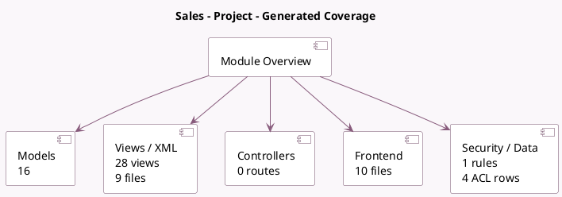

<!-- GENERATED:MODULE -->
---
tags: [odoo, community, module]
---

# Sales - Project

- Scope: Community Addons
- Source: odoo/addons/sale_project
- Dependencies: [[docs/Community Addons/sale_management/sale_management|sale_management]], [[docs/Community Addons/sale_service/sale_service|sale_service]], [[docs/Community Addons/project_account/project_account|project_account]]

## Summary

Task Generation from Sales Orders

## Generated coverage

- Models: 16
- XML files with UI/data artifacts: 9
- Views: 28
- Actions: 10
- Menus: 0
- Rules (ir.rule): 1
- Access CSV entries: 4
- Controller units: 0
- Frontend asset files: 10

## Module map

## Detail notes

- Models: [[docs/Community Addons/sale_project/Models|Models]] (16)
- Views and XML: [[docs/Community Addons/sale_project/Views|Views]] (9 files)
- Frontend: [[docs/Community Addons/sale_project/Frontend|Frontend]] (10 files)

## Key models

- `account.move`
- `account.move.line`
- `product.product`
- `product.template`
- `project.milestone`
- `project.project`
- `project.task`
- `project.task.recurrence`
- `project.task.type`
- `project.template.create.wizard`
- `project.update`
- `report.project.task.user`

## Navigation

- [[../Community Addons/Community Addons|Back to scope]]
- [[../../docs/docs|Back to docs]]

<!-- GENERATED:MODULE -->

