<!-- GENERATED:MODEL -->
---
tags: [odoo, community, generated, model]
---

# sale.order.line

- Module: [[docs/Community Addons/sale_purchase/sale_purchase|sale_purchase]]
- Scope: Community Addons
- Defined in module: extension only
- Source files: `models/sale_order_line.py`
- Python classes: `SaleOrderLine`

## Field footprint

- Detected fields: 2
- Field types: `Integer` x 1, `One2many` x 1
- Relation fields: 1

## Sample fields

- `purchase_line_count`: `Integer` (comodel `Number of generated purchase items`, compute `_compute_purchase_count`)
- `purchase_line_ids`: `One2many` (comodel `purchase.order.line`)

## Method hints

- Detected methods: 20
- Action methods: none
- Compute methods: `_compute_purchase_count`
- Onchange methods: `_onchange_service_product_uom_qty`

## Direct relation diagram

```plantuml
@startuml
!define ODOO_COLOR_PRIMARY #714B67
!define ODOO_COLOR_ACCENT #875A7B
!define ODOO_COLOR_BG #FAF7FA

skinparam backgroundColor ODOO_COLOR_BG
skinparam defaultTextAlignment left
skinparam ArrowColor ODOO_COLOR_ACCENT
skinparam ClassBackgroundColor white
skinparam ClassBorderColor ODOO_COLOR_PRIMARY
skinparam ComponentBackgroundColor white
skinparam ComponentBorderColor ODOO_COLOR_PRIMARY
skinparam NoteBackgroundColor #FFF8FF
skinparam NoteBorderColor ODOO_COLOR_ACCENT
skinparam SequenceLifeLineBorderColor ODOO_COLOR_ACCENT
skinparam SequenceLifeLineBackgroundColor #FFFFFF
skinparam SequenceParticipantBorderColor ODOO_COLOR_PRIMARY
skinparam SequenceParticipantBackgroundColor #FFFFFF
skinparam sequence {
  ArrowColor ODOO_COLOR_ACCENT
  ActorBorderColor ODOO_COLOR_PRIMARY
}
title sale.order.line - Direct Relations
class "sale.order.line" as sale_order_line
class "purchase.order.line" as purchase_order_line
sale_order_line --|> purchase_order_line : purchase_line_ids
@enduml
```

## Navigation

- **Parent:** [[docs/Community Addons/sale_purchase/Models]]

<!-- GENERATED:MODEL -->
