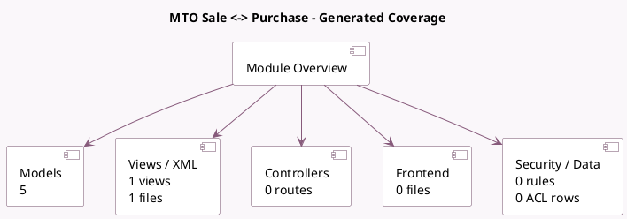

<!-- GENERATED:MODULE -->
---
tags: [odoo, community, module]
---

# MTO Sale <-> Purchase

- Scope: Community Addons
- Source: odoo/addons/sale_purchase_stock
- Dependencies: [[docs/Community Addons/sale_stock/sale_stock|sale_stock]], [[docs/Community Addons/purchase_stock/purchase_stock|purchase_stock]], [[docs/Community Addons/sale_purchase/sale_purchase|sale_purchase]]

## Summary

SO/PO relation in case of MTO

## Generated coverage

- Models: 5
- XML files with UI/data artifacts: 1
- Views: 1
- Actions: 0
- Menus: 0
- Rules (ir.rule): 0
- Access CSV entries: 0
- Controller units: 0
- Frontend asset files: 0

## Module map

## Detail notes

- Models: [[docs/Community Addons/sale_purchase_stock/Models|Models]] (5)
- Views and XML: [[docs/Community Addons/sale_purchase_stock/Views|Views]] (1 files)

## Key models

- `purchase.order`
- `purchase.order.line`
- `sale.order`
- `stock.move`
- `stock.rule`

## Navigation

- [[../Community Addons/Community Addons|Back to scope]]
- [[../../docs/docs|Back to docs]]

<!-- GENERATED:MODULE -->

