<!-- GENERATED:MODEL -->
---
tags: [odoo, community, generated, model]
---

# sale.order.line

- Module: [[docs/Community Addons/sale_stock/sale_stock|sale_stock]]
- Scope: Community Addons
- Defined in module: extension only
- Source files: `models/sale_order_line.py`
- Python classes: `SaleOrderLine`

## Field footprint

- Detected fields: 14
- Field types: `Boolean` x 3, `Datetime` x 2, `Float` x 5, `Many2many` x 1, `Many2one` x 1, `One2many` x 1, `Selection` x 1
- Relation fields: 3

## Sample fields

- `customer_lead`: `Float` (compute `_compute_customer_lead`, store `True`)
- `display_qty_widget`: `Boolean` (compute `_compute_qty_to_deliver`)
- `forecast_expected_date`: `Datetime` (compute `_compute_qty_at_date`)
- `free_qty_today`: `Float` (compute `_compute_qty_at_date`)
- `is_mto`: `Boolean` (compute `_compute_is_mto`)
- `is_storable`: `Boolean` (related `product_id.is_storable`)
- `move_ids`: `One2many` (comodel `stock.move`)
- `qty_available_today`: `Float` (compute `_compute_qty_at_date`)
- `qty_delivered_method`: `Selection`
- `qty_to_deliver`: `Float` (compute `_compute_qty_to_deliver`)
- `route_ids`: `Many2many` (comodel `stock.route`)
- `scheduled_date`: `Datetime` (compute `_compute_qty_at_date`)
- `virtual_available_at_date`: `Float` (compute `_compute_qty_at_date`)
- `warehouse_id`: `Many2one` (comodel `stock.warehouse`, compute `_compute_warehouse_id`, store `True`)

## Method hints

- Detected methods: 22
- Action methods: none
- Compute methods: `_compute_customer_lead`, `_compute_is_mto`, `_compute_product_updatable`, `_compute_qty_at_date`, `_compute_qty_delivered`, `_compute_qty_delivered_method`, `_compute_qty_to_deliver`, `_compute_warehouse_id`
- Onchange methods: none

## Direct relation diagram

```plantuml
@startuml
!define ODOO_COLOR_PRIMARY #714B67
!define ODOO_COLOR_ACCENT #875A7B
!define ODOO_COLOR_BG #FAF7FA

skinparam backgroundColor ODOO_COLOR_BG
skinparam defaultTextAlignment left
skinparam ArrowColor ODOO_COLOR_ACCENT
skinparam ClassBackgroundColor white
skinparam ClassBorderColor ODOO_COLOR_PRIMARY
skinparam ComponentBackgroundColor white
skinparam ComponentBorderColor ODOO_COLOR_PRIMARY
skinparam NoteBackgroundColor #FFF8FF
skinparam NoteBorderColor ODOO_COLOR_ACCENT
skinparam SequenceLifeLineBorderColor ODOO_COLOR_ACCENT
skinparam SequenceLifeLineBackgroundColor #FFFFFF
skinparam SequenceParticipantBorderColor ODOO_COLOR_PRIMARY
skinparam SequenceParticipantBackgroundColor #FFFFFF
skinparam sequence {
  ArrowColor ODOO_COLOR_ACCENT
  ActorBorderColor ODOO_COLOR_PRIMARY
}
title sale.order.line - Direct Relations
class "sale.order.line" as sale_order_line
class "stock.move" as stock_move
class "stock.route" as stock_route
class "stock.warehouse" as stock_warehouse
sale_order_line .. stock_route : route_ids
sale_order_line --|> stock_move : move_ids
sale_order_line --> stock_warehouse : warehouse_id
@enduml
```

## Navigation

- **Parent:** [[docs/Community Addons/sale_stock/Models]]

<!-- GENERATED:MODEL -->
