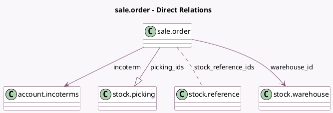

<!-- GENERATED:MODEL -->
---
tags: [odoo, community, generated, model]
---

# sale.order

- Module: [[docs/Community Addons/sale_stock/sale_stock|sale_stock]]
- Scope: Community Addons
- Defined in module: extension only
- Source files: `models/sale_order.py`
- Python classes: `SaleOrder`

## Field footprint

- Detected fields: 13
- Field types: `Boolean` x 2, `Char` x 2, `Datetime` x 2, `Integer` x 1, `Many2many` x 1, `Many2one` x 2, `One2many` x 1, `Selection` x 2
- Relation fields: 4

## Sample fields

- `delivery_count`: `Integer` (compute `_compute_picking_ids`)
- `delivery_status`: `Selection` (compute `_compute_delivery_status`, store `True`)
- `effective_date`: `Datetime` (comodel `Effective Date`, compute `_compute_effective_date`, store `True`)
- `expected_date`: `Datetime`
- `incoterm`: `Many2one` (comodel `account.incoterms`)
- `incoterm_location`: `Char`
- `json_popover`: `Char` (comodel `JSON data for the popover widget`, compute `_compute_json_popover`)
- `late_availability`: `Boolean` (compute `_compute_late_availability`)
- `picking_ids`: `One2many` (comodel `stock.picking`)
- `picking_policy`: `Selection`
- `show_json_popover`: `Boolean` (comodel `Has late picking`, compute `_compute_json_popover`)
- `stock_reference_ids`: `Many2many` (comodel `stock.reference`)
- `warehouse_id`: `Many2one` (comodel `stock.warehouse`, compute `_compute_warehouse_id`, store `True`)

## Method hints

- Detected methods: 20
- Action methods: `action_view_delivery`
- Compute methods: `_compute_delivery_status`, `_compute_effective_date`, `_compute_expected_date`, `_compute_json_popover`, `_compute_late_availability`, `_compute_picking_ids`, `_compute_warehouse_id`
- Onchange methods: `_onchange_partner_shipping_id`

## Direct relation diagram

## Navigation

- **Parent:** [[docs/Community Addons/sale_stock/Models]]

<!-- GENERATED:MODEL -->
