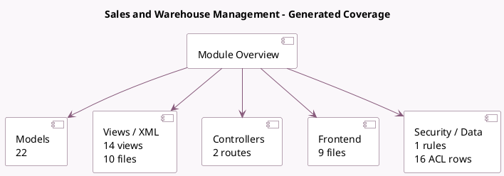

<!-- GENERATED:MODULE -->
---
tags: [odoo, community, module]
---

# Sales and Warehouse Management

- Scope: Community Addons
- Source: odoo/addons/sale_stock
- Dependencies: [[docs/Community Addons/sale/sale|sale]], [[docs/Community Addons/stock_account/stock_account|stock_account]]

## Summary

Quotation, Sales Orders, Delivery & Invoicing Control

## Generated coverage

- Models: 22
- XML files with UI/data artifacts: 10
- Views: 14
- Actions: 0
- Menus: 0
- Rules (ir.rule): 1
- Access CSV entries: 16
- Controller units: 1
- Frontend asset files: 9

## Module map

## Detail notes

- Models: [[docs/Community Addons/sale_stock/Models|Models]] (22)
- Views and XML: [[docs/Community Addons/sale_stock/Views|Views]] (10 files)
- Controllers: [[docs/Community Addons/sale_stock/Controllers|Controllers]] (1)
- Frontend: [[docs/Community Addons/sale_stock/Frontend|Frontend]] (9 files)

## Key models

- `account.move`
- `account.move.line`
- `product.template`
- `report.stock.report_stock_rule`
- `res.company`
- `res.config.settings`
- `res.users`
- `sale.order`
- `sale.order.line`
- `sale.report`
- `stock.forecasted_product_product`
- `stock.lot`

## Navigation

- [[../Community Addons/Community Addons|Back to scope]]
- [[../../docs/docs|Back to docs]]

<!-- GENERATED:MODULE -->

