<!-- GENERATED:MODEL -->
---
tags: [odoo, community, generated, model]
---

# account.analytic.line

- Module: [[docs/Community Addons/sale_timesheet/sale_timesheet|sale_timesheet]]
- Scope: Community Addons
- Defined in module: extension only
- Source files: `models/hr_timesheet.py`
- Python classes: `AccountAnalyticLine`

## Field footprint

- Detected fields: 8
- Field types: `Boolean` x 2, `Many2one` x 4, `Selection` x 2
- Relation fields: 4

## Sample fields

- `allow_billable`: `Boolean` (related `project_id.allow_billable`)
- `commercial_partner_id`: `Many2one` (comodel `res.partner`, compute `_compute_commercial_partner`)
- `is_so_line_edited`: `Boolean` (comodel `Is Sales Order Item Manually Edited`)
- `order_id`: `Many2one` (related `so_line.order_id`, store `True`)
- `sale_order_state`: `Selection` (related `order_id.state`)
- `so_line`: `Many2one` (compute `_compute_so_line`, store `True`)
- `timesheet_invoice_id`: `Many2one` (comodel `account.move`)
- `timesheet_invoice_type`: `Selection` (compute `_compute_timesheet_invoice_type`, store `True`)

## Method hints

- Detected methods: 23
- Action methods: `action_invoice_from_timesheet`, `action_sale_order_from_timesheet`
- Compute methods: `_compute_commercial_partner`, `_compute_partner_id`, `_compute_project_id`, `_compute_so_line`, `_compute_timesheet_invoice_type`
- Onchange methods: none

## Direct relation diagram

```plantuml
@startuml
!define ODOO_COLOR_PRIMARY #714B67
!define ODOO_COLOR_ACCENT #875A7B
!define ODOO_COLOR_BG #FAF7FA

skinparam backgroundColor ODOO_COLOR_BG
skinparam defaultTextAlignment left
skinparam ArrowColor ODOO_COLOR_ACCENT
skinparam ClassBackgroundColor white
skinparam ClassBorderColor ODOO_COLOR_PRIMARY
skinparam ComponentBackgroundColor white
skinparam ComponentBorderColor ODOO_COLOR_PRIMARY
skinparam NoteBackgroundColor #FFF8FF
skinparam NoteBorderColor ODOO_COLOR_ACCENT
skinparam SequenceLifeLineBorderColor ODOO_COLOR_ACCENT
skinparam SequenceLifeLineBackgroundColor #FFFFFF
skinparam SequenceParticipantBorderColor ODOO_COLOR_PRIMARY
skinparam SequenceParticipantBackgroundColor #FFFFFF
skinparam sequence {
  ArrowColor ODOO_COLOR_ACCENT
  ActorBorderColor ODOO_COLOR_PRIMARY
}
title account.analytic.line - Direct Relations
class "account.analytic.line" as account_analytic_line
class "account.move" as account_move
class "res.partner" as res_partner
account_analytic_line --> res_partner : commercial_partner_id
account_analytic_line --> account_move : timesheet_invoice_id
@enduml
```

## Navigation

- **Parent:** [[docs/Community Addons/sale_timesheet/Models]]

<!-- GENERATED:MODEL -->
