<!-- GENERATED:MODEL -->
---
tags: [odoo, community, generated, model]
---

# account.move

- Module: [[docs/Community Addons/sale_timesheet/sale_timesheet|sale_timesheet]]
- Scope: Community Addons
- Defined in module: extension only
- Source files: `models/account_move.py`
- Python classes: `AccountMove`

## Field footprint

- Detected fields: 4
- Field types: `Integer` x 2, `Many2one` x 1, `One2many` x 1
- Relation fields: 2

## Sample fields

- `timesheet_count`: `Integer` (comodel `Number of timesheets`, compute `_compute_timesheet_count`)
- `timesheet_encode_uom_id`: `Many2one` (comodel `uom.uom`, related `company_id.timesheet_encode_uom_id`)
- `timesheet_ids`: `One2many` (comodel `account.analytic.line`)
- `timesheet_total_duration`: `Integer` (comodel `Timesheet Total Duration`, compute `_compute_timesheet_total_duration`)

## Method hints

- Detected methods: 5
- Action methods: `action_view_timesheet`
- Compute methods: `_compute_timesheet_count`, `_compute_timesheet_total_duration`
- Onchange methods: none

## Direct relation diagram

```plantuml
@startuml
!define ODOO_COLOR_PRIMARY #714B67
!define ODOO_COLOR_ACCENT #875A7B
!define ODOO_COLOR_BG #FAF7FA

skinparam backgroundColor ODOO_COLOR_BG
skinparam defaultTextAlignment left
skinparam ArrowColor ODOO_COLOR_ACCENT
skinparam ClassBackgroundColor white
skinparam ClassBorderColor ODOO_COLOR_PRIMARY
skinparam ComponentBackgroundColor white
skinparam ComponentBorderColor ODOO_COLOR_PRIMARY
skinparam NoteBackgroundColor #FFF8FF
skinparam NoteBorderColor ODOO_COLOR_ACCENT
skinparam SequenceLifeLineBorderColor ODOO_COLOR_ACCENT
skinparam SequenceLifeLineBackgroundColor #FFFFFF
skinparam SequenceParticipantBorderColor ODOO_COLOR_PRIMARY
skinparam SequenceParticipantBackgroundColor #FFFFFF
skinparam sequence {
  ArrowColor ODOO_COLOR_ACCENT
  ActorBorderColor ODOO_COLOR_PRIMARY
}
title account.move - Direct Relations
class "account.move" as account_move
class "account.analytic.line" as account_analytic_line
class "uom.uom" as uom_uom
account_move --|> account_analytic_line : timesheet_ids
account_move --> uom_uom : timesheet_encode_uom_id
@enduml
```

## Navigation

- **Parent:** [[docs/Community Addons/sale_timesheet/Models]]

<!-- GENERATED:MODEL -->
