<!-- GENERATED:MODEL -->
---
tags: [odoo, community, generated, model]
---

# product.template

- Module: [[docs/Community Addons/sale_timesheet/sale_timesheet|sale_timesheet]]
- Scope: Community Addons
- Defined in module: extension only
- Source files: `models/product_template.py`
- Python classes: `ProductTemplate`

## Field footprint

- Detected fields: 5
- Field types: `Char` x 1, `Float` x 1, `Many2one` x 2, `Selection` x 1
- Relation fields: 2

## Sample fields

- `project_id`: `Many2one`
- `project_template_id`: `Many2one`
- `service_type`: `Selection`
- `service_upsell_threshold`: `Float` (comodel `Threshold`)
- `service_upsell_threshold_ratio`: `Char` (compute `_compute_service_upsell_threshold_ratio`)

## Method hints

- Detected methods: 10
- Action methods: none
- Compute methods: `_compute_service_upsell_threshold_ratio`, `_compute_visible_expense_policy`
- Onchange methods: `_onchange_service_fields`, `_onchange_service_policy`

## Direct relation diagram

```plantuml
@startuml
!define ODOO_COLOR_PRIMARY #714B67
!define ODOO_COLOR_ACCENT #875A7B
!define ODOO_COLOR_BG #FAF7FA

skinparam backgroundColor ODOO_COLOR_BG
skinparam defaultTextAlignment left
skinparam ArrowColor ODOO_COLOR_ACCENT
skinparam ClassBackgroundColor white
skinparam ClassBorderColor ODOO_COLOR_PRIMARY
skinparam ComponentBackgroundColor white
skinparam ComponentBorderColor ODOO_COLOR_PRIMARY
skinparam NoteBackgroundColor #FFF8FF
skinparam NoteBorderColor ODOO_COLOR_ACCENT
skinparam SequenceLifeLineBorderColor ODOO_COLOR_ACCENT
skinparam SequenceLifeLineBackgroundColor #FFFFFF
skinparam SequenceParticipantBorderColor ODOO_COLOR_PRIMARY
skinparam SequenceParticipantBackgroundColor #FFFFFF
skinparam sequence {
  ArrowColor ODOO_COLOR_ACCENT
  ActorBorderColor ODOO_COLOR_PRIMARY
}
title product.template - Direct Relations
class "product.template" as product_template
@enduml
```

## Navigation

- **Parent:** [[docs/Community Addons/sale_timesheet/Models]]

<!-- GENERATED:MODEL -->
