<!-- GENERATED:MODEL -->
---
tags: [odoo, community, generated, model]
---

# project.project

- Module: [[docs/Community Addons/sale_timesheet/sale_timesheet|sale_timesheet]]
- Scope: Community Addons
- Defined in module: extension only
- Source files: `models/project_project.py`
- Python classes: `ProjectProject`

## Field footprint

- Detected fields: 7
- Field types: `Boolean` x 1, `Float` x 1, `Many2one` x 2, `One2many` x 1, `Selection` x 2
- Relation fields: 3

## Sample fields

- `allocated_hours`: `Float`
- `billing_type`: `Selection` (compute `_compute_billing_type`, store `True`)
- `partner_id`: `Many2one` (compute `_compute_partner_id`, store `True`)
- `pricing_type`: `Selection` (compute `_compute_pricing_type`)
- `sale_line_employee_ids`: `One2many` (comodel `project.sale.line.employee.map`)
- `timesheet_product_id`: `Many2one` (comodel `product.product`, compute `_compute_timesheet_product_id`, store `True`)
- `warning_employee_rate`: `Boolean` (compute `_compute_warning_employee_rate`)

## Method hints

- Detected methods: 31
- Action methods: `action_billable_time_button`, `action_profitability_items`, `action_project_timesheets`, `action_view_timesheet`
- Compute methods: `_compute_billing_type`, `_compute_partner_id`, `_compute_pricing_type`, `_compute_sale_line_id`, `_compute_sale_order_count`, `_compute_timesheet_product_id`, `_compute_warning_employee_rate`
- Onchange methods: none

## Direct relation diagram

```plantuml
@startuml
!define ODOO_COLOR_PRIMARY #714B67
!define ODOO_COLOR_ACCENT #875A7B
!define ODOO_COLOR_BG #FAF7FA

skinparam backgroundColor ODOO_COLOR_BG
skinparam defaultTextAlignment left
skinparam ArrowColor ODOO_COLOR_ACCENT
skinparam ClassBackgroundColor white
skinparam ClassBorderColor ODOO_COLOR_PRIMARY
skinparam ComponentBackgroundColor white
skinparam ComponentBorderColor ODOO_COLOR_PRIMARY
skinparam NoteBackgroundColor #FFF8FF
skinparam NoteBorderColor ODOO_COLOR_ACCENT
skinparam SequenceLifeLineBorderColor ODOO_COLOR_ACCENT
skinparam SequenceLifeLineBackgroundColor #FFFFFF
skinparam SequenceParticipantBorderColor ODOO_COLOR_PRIMARY
skinparam SequenceParticipantBackgroundColor #FFFFFF
skinparam sequence {
  ArrowColor ODOO_COLOR_ACCENT
  ActorBorderColor ODOO_COLOR_PRIMARY
}
title project.project - Direct Relations
class "project.project" as project_project
class "product.product" as product_product
class "project.sale.line.employee.map" as project_sale_line_employee_map
project_project --|> project_sale_line_employee_map : sale_line_employee_ids
project_project --> product_product : timesheet_product_id
@enduml
```

## Navigation

- **Parent:** [[docs/Community Addons/sale_timesheet/Models]]

<!-- GENERATED:MODEL -->
