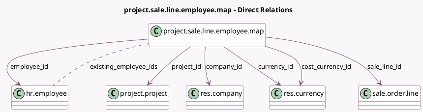

<!-- GENERATED:MODEL -->
---
tags: [odoo, community, generated, model]
---

# project.sale.line.employee.map

- Module: [[docs/Community Addons/sale_timesheet/sale_timesheet|sale_timesheet]]
- Scope: Community Addons
- Defined in module: yes
- Source files: `models/project_sale_line_employee_map.py`
- Python classes: `ProjectSaleLineEmployeeMap`
- Description: Project Sales line, employee mapping

## Field footprint

- Detected fields: 13
- Field types: `Boolean` x 1, `Float` x 1, `Many2many` x 1, `Many2one` x 8, `Monetary` x 2
- Relation fields: 9

## Sample fields

- `company_id`: `Many2one` (comodel `res.company`, related `project_id.company_id`)
- `cost`: `Monetary` (compute `_compute_cost`, store `True`)
- `cost_currency_id`: `Many2one` (comodel `res.currency`, related `employee_id.currency_id`)
- `currency_id`: `Many2one` (comodel `res.currency`, compute `_compute_currency_id`, store `True`)
- `display_cost`: `Monetary` (compute `_compute_display_cost`)
- `employee_id`: `Many2one` (comodel `hr.employee`)
- `existing_employee_ids`: `Many2many` (comodel `hr.employee`, compute `_compute_existing_employee_ids`)
- `is_cost_changed`: `Boolean` (comodel `Is Cost Manually Changed`, compute `_compute_is_cost_changed`, store `True`)
- `partner_id`: `Many2one` (related `project_id.partner_id`)
- `price_unit`: `Float` (comodel `Unit Price`, compute `_compute_price_unit`, store `True`)
- `project_id`: `Many2one` (comodel `project.project`)
- `sale_line_id`: `Many2one` (comodel `sale.order.line`, compute `_compute_sale_line_id`, store `True`)
- `sale_order_id`: `Many2one` (related `project_id.sale_order_id`)

## Method hints

- Detected methods: 13
- Action methods: none
- Compute methods: `_compute_cost`, `_compute_currency_id`, `_compute_display_cost`, `_compute_existing_employee_ids`, `_compute_is_cost_changed`, `_compute_price_unit`, `_compute_sale_line_id`
- Onchange methods: none

## Direct relation diagram

## Navigation

- **Parent:** [[docs/Community Addons/sale_timesheet/Models]]

<!-- GENERATED:MODEL -->
