<!-- GENERATED:MODEL -->
---
tags: [odoo, community, generated, model]
---

# project.task

- Module: [[docs/Community Addons/sale_timesheet/sale_timesheet|sale_timesheet]]
- Scope: Community Addons
- Defined in module: extension only
- Source files: `models/project_task.py`
- Python classes: `ProjectTask`

## Field footprint

- Detected fields: 8
- Field types: `Boolean` x 3, `Float` x 1, `Many2one` x 3, `Selection` x 1
- Relation fields: 3

## Sample fields

- `has_multi_sol`: `Boolean` (compute `_compute_has_multi_sol`)
- `is_project_map_empty`: `Boolean` (comodel `Is Project map empty`, compute `_compute_is_project_map_empty`)
- `last_sol_of_customer`: `Many2one` (comodel `sale.order.line`, compute `_compute_last_sol_of_customer`)
- `pricing_type`: `Selection` (related `project_id.pricing_type`)
- `remaining_hours_available`: `Boolean` (related `sale_line_id.remaining_hours_available`)
- `remaining_hours_so`: `Float` (comodel `Time Remaining on SO`, compute `_compute_remaining_hours_so`)
- `sale_order_id`: `Many2one`
- `timesheet_product_id`: `Many2one` (related `project_id.timesheet_product_id`)

## Method hints

- Detected methods: 12
- Action methods: none
- Compute methods: `_compute_has_multi_sol`, `_compute_is_project_map_empty`, `_compute_last_sol_of_customer`, `_compute_remaining_hours_so`, `_compute_sale_line`
- Onchange methods: none

## Direct relation diagram

```plantuml
@startuml
!define ODOO_COLOR_PRIMARY #714B67
!define ODOO_COLOR_ACCENT #875A7B
!define ODOO_COLOR_BG #FAF7FA

skinparam backgroundColor ODOO_COLOR_BG
skinparam defaultTextAlignment left
skinparam ArrowColor ODOO_COLOR_ACCENT
skinparam ClassBackgroundColor white
skinparam ClassBorderColor ODOO_COLOR_PRIMARY
skinparam ComponentBackgroundColor white
skinparam ComponentBorderColor ODOO_COLOR_PRIMARY
skinparam NoteBackgroundColor #FFF8FF
skinparam NoteBorderColor ODOO_COLOR_ACCENT
skinparam SequenceLifeLineBorderColor ODOO_COLOR_ACCENT
skinparam SequenceLifeLineBackgroundColor #FFFFFF
skinparam SequenceParticipantBorderColor ODOO_COLOR_PRIMARY
skinparam SequenceParticipantBackgroundColor #FFFFFF
skinparam sequence {
  ArrowColor ODOO_COLOR_ACCENT
  ActorBorderColor ODOO_COLOR_PRIMARY
}
title project.task - Direct Relations
class "project.task" as project_task
class "sale.order.line" as sale_order_line
project_task --> sale_order_line : last_sol_of_customer
@enduml
```

## Navigation

- **Parent:** [[docs/Community Addons/sale_timesheet/Models]]

<!-- GENERATED:MODEL -->
