<!-- GENERATED:MODEL -->
---
tags: [odoo, community, generated, model]
---

# sale.order.line

- Module: [[docs/Community Addons/sale_timesheet/sale_timesheet|sale_timesheet]]
- Scope: Community Addons
- Defined in module: extension only
- Source files: `models/sale_order_line.py`
- Python classes: `SaleOrderLine`

## Field footprint

- Detected fields: 6
- Field types: `Boolean` x 2, `Float` x 1, `One2many` x 2, `Selection` x 1
- Relation fields: 2

## Sample fields

- `analytic_line_ids`: `One2many`
- `has_displayed_warning_upsell`: `Boolean` (comodel `Has Displayed Warning Upsell`)
- `qty_delivered_method`: `Selection`
- `remaining_hours`: `Float` (comodel `Time Remaining on SO`, compute `_compute_remaining_hours`, store `True`)
- `remaining_hours_available`: `Boolean` (compute `_compute_remaining_hours_available`)
- `timesheet_ids`: `One2many` (comodel `account.analytic.line`)

## Method hints

- Detected methods: 12
- Action methods: none
- Compute methods: `_compute_display_name`, `_compute_qty_delivered`, `_compute_qty_delivered_method`, `_compute_remaining_hours`, `_compute_remaining_hours_available`
- Onchange methods: none

## Direct relation diagram

```plantuml
@startuml
!define ODOO_COLOR_PRIMARY #714B67
!define ODOO_COLOR_ACCENT #875A7B
!define ODOO_COLOR_BG #FAF7FA

skinparam backgroundColor ODOO_COLOR_BG
skinparam defaultTextAlignment left
skinparam ArrowColor ODOO_COLOR_ACCENT
skinparam ClassBackgroundColor white
skinparam ClassBorderColor ODOO_COLOR_PRIMARY
skinparam ComponentBackgroundColor white
skinparam ComponentBorderColor ODOO_COLOR_PRIMARY
skinparam NoteBackgroundColor #FFF8FF
skinparam NoteBorderColor ODOO_COLOR_ACCENT
skinparam SequenceLifeLineBorderColor ODOO_COLOR_ACCENT
skinparam SequenceLifeLineBackgroundColor #FFFFFF
skinparam SequenceParticipantBorderColor ODOO_COLOR_PRIMARY
skinparam SequenceParticipantBackgroundColor #FFFFFF
skinparam sequence {
  ArrowColor ODOO_COLOR_ACCENT
  ActorBorderColor ODOO_COLOR_PRIMARY
}
title sale.order.line - Direct Relations
class "sale.order.line" as sale_order_line
class "account.analytic.line" as account_analytic_line
sale_order_line --|> account_analytic_line : timesheet_ids
@enduml
```

## Navigation

- **Parent:** [[docs/Community Addons/sale_timesheet/Models]]

<!-- GENERATED:MODEL -->
