<!-- GENERATED:MODEL -->
---
tags: [odoo, community, generated, model]
---

# timesheets.analysis.report

- Module: [[docs/Community Addons/sale_timesheet/sale_timesheet|sale_timesheet]]
- Scope: Community Addons
- Defined in module: extension only
- Source files: `report/timesheets_analysis_report.py`
- Python classes: `TimesheetsAnalysisReport`

## Field footprint

- Detected fields: 8
- Field types: `Float` x 2, `Many2one` x 3, `Monetary` x 2, `Selection` x 1
- Relation fields: 3

## Sample fields

- `billable_time`: `Float` (comodel `Billable Time`)
- `margin`: `Monetary` (comodel `Margin`)
- `non_billable_time`: `Float` (comodel `Non-billable Time`)
- `order_id`: `Many2one` (comodel `sale.order`)
- `so_line`: `Many2one` (comodel `sale.order.line`)
- `timesheet_invoice_id`: `Many2one` (comodel `account.move`)
- `timesheet_invoice_type`: `Selection`
- `timesheet_revenues`: `Monetary` (comodel `Timesheet Revenues`)

## Method hints

- Detected methods: 3
- Action methods: none
- Compute methods: none
- Onchange methods: none

## Direct relation diagram

```plantuml
@startuml
!define ODOO_COLOR_PRIMARY #714B67
!define ODOO_COLOR_ACCENT #875A7B
!define ODOO_COLOR_BG #FAF7FA

skinparam backgroundColor ODOO_COLOR_BG
skinparam defaultTextAlignment left
skinparam ArrowColor ODOO_COLOR_ACCENT
skinparam ClassBackgroundColor white
skinparam ClassBorderColor ODOO_COLOR_PRIMARY
skinparam ComponentBackgroundColor white
skinparam ComponentBorderColor ODOO_COLOR_PRIMARY
skinparam NoteBackgroundColor #FFF8FF
skinparam NoteBorderColor ODOO_COLOR_ACCENT
skinparam SequenceLifeLineBorderColor ODOO_COLOR_ACCENT
skinparam SequenceLifeLineBackgroundColor #FFFFFF
skinparam SequenceParticipantBorderColor ODOO_COLOR_PRIMARY
skinparam SequenceParticipantBackgroundColor #FFFFFF
skinparam sequence {
  ArrowColor ODOO_COLOR_ACCENT
  ActorBorderColor ODOO_COLOR_PRIMARY
}
title timesheets.analysis.report - Direct Relations
class "timesheets.analysis.report" as timesheets_analysis_report
class "account.move" as account_move
class "sale.order" as sale_order
class "sale.order.line" as sale_order_line
timesheets_analysis_report --> sale_order : order_id
timesheets_analysis_report --> sale_order_line : so_line
timesheets_analysis_report --> account_move : timesheet_invoice_id
@enduml
```

## Navigation

- **Parent:** [[docs/Community Addons/sale_timesheet/Models]]

<!-- GENERATED:MODEL -->
