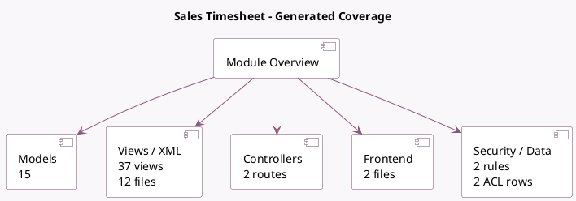

<!-- GENERATED:MODULE -->
---
tags: [odoo, community, module]
---

# Sales Timesheet

- Scope: Community Addons
- Source: odoo/addons/sale_timesheet
- Dependencies: [[docs/Community Addons/sale_project/sale_project|sale_project]], [[docs/Community Addons/hr_timesheet/hr_timesheet|hr_timesheet]]

## Summary

Sell based on timesheets

## Generated coverage

- Models: 15
- XML files with UI/data artifacts: 12
- Views: 37
- Actions: 24
- Menus: 1
- Rules (ir.rule): 2
- Access CSV entries: 2
- Controller units: 2
- Frontend asset files: 2

## Module map

## Detail notes

- Models: [[docs/Community Addons/sale_timesheet/Models|Models]] (15)
- Views and XML: [[docs/Community Addons/sale_timesheet/Views|Views]] (12 files)
- Controllers: [[docs/Community Addons/sale_timesheet/Controllers|Controllers]] (2)
- Frontend: [[docs/Community Addons/sale_timesheet/Frontend|Frontend]] (2 files)

## Key models

- `account.analytic.line`
- `account.move`
- `account.move.line`
- `hr.employee`
- `product.product`
- `product.template`
- `project.project`
- `project.sale.line.employee.map`
- `project.task`
- `report.project.task.user`
- `res.config.settings`
- `sale.advance.payment.inv`

## Navigation

- [[../Community Addons/Community Addons|Back to scope]]
- [[../../docs/docs|Back to docs]]

<!-- GENERATED:MODULE -->

