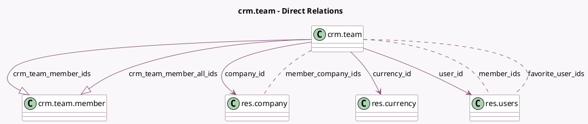

<!-- GENERATED:MODEL -->
---
tags: [odoo, community, generated, model]
---

# crm.team

- Module: [[docs/Community Addons/sales_team/sales_team|sales_team]]
- Scope: Community Addons
- Defined in module: yes
- Source files: `models/crm_team.py`
- Python classes: `CrmTeam`
- Description: Sales Team
- Inherits: `mail.thread`

## Field footprint

- Detected fields: 16
- Field types: `Boolean` x 3, `Char` x 2, `Integer` x 2, `Many2many` x 3, `Many2one` x 3, `One2many` x 2, `Text` x 1
- Relation fields: 8

## Sample fields

- `active`: `Boolean`
- `color`: `Integer`
- `company_id`: `Many2one` (comodel `res.company`)
- `crm_team_member_all_ids`: `One2many` (comodel `crm.team.member`)
- `crm_team_member_ids`: `One2many` (comodel `crm.team.member`)
- `currency_id`: `Many2one` (comodel `res.currency`, related `company_id.currency_id`)
- `dashboard_button_name`: `Char` (compute `_compute_dashboard_button_name`)
- `favorite_user_ids`: `Many2many` (comodel `res.users`)
- `is_favorite`: `Boolean` (compute `_compute_is_favorite`)
- `is_membership_multi`: `Boolean` (comodel `Multiple Memberships Allowed`, compute `_compute_is_membership_multi`)
- `member_company_ids`: `Many2many` (comodel `res.company`, compute `_compute_member_company_ids`)
- `member_ids`: `Many2many` (comodel `res.users`, compute `_compute_member_ids`)
- `member_warning`: `Text` (comodel `Membership Issue Warning`, compute `_compute_member_warning`)
- `name`: `Char` (comodel `Sales Team`)
- `sequence`: `Integer` (comodel `Sequence`)
- `user_id`: `Many2one` (comodel `res.users`)

## Method hints

- Detected methods: 17
- Action methods: `action_primary_channel_button`
- Compute methods: `_compute_dashboard_button_name`, `_compute_is_favorite`, `_compute_is_membership_multi`, `_compute_member_company_ids`, `_compute_member_ids`, `_compute_member_warning`
- Onchange methods: none

## Direct relation diagram

## Navigation

- **Parent:** [[docs/Community Addons/sales_team/Models]]

<!-- GENERATED:MODEL -->
